# HTTP缓存

HTTP 缓存机制作为 web 性能优化的重要手段，对于从事 Web 开发的同学们来说，应该是知识体系库中的一个基础环节，同时对于有志成为前端架构师的同学来说是必备的知识技能。

但是对于很多前端同学来说，仅仅只是知道浏览器会对请求的静态文件进行缓存，但是为什么被缓存，缓存是怎样生效的，却并不是很清楚。

**缓存的优点：**

1、减少了冗余的数据传输，节省了网络费用。

2、缓解了网络瓶颈问题，不需要更多的宽带就能够更快加载页面。

3、降低了对服务器的要求，避免过载的出现。

4、降低了距离时延，从较远的地方加载的页面也能很快打开。

## 实现

创建一个简易的 `html` ，引入 `jquery.12d543bd.js` 。

```html
<html>
  <head>
    <script src="./jquery.12d543bd.js"></script>
  </head>

  <body>
  </body>
</html>
```

为了能模拟请求，在根目录建一个本地服务器 `server.js` 

```js
var fs = require('fs');
var http = require('http');
var path = require('path');

http.createServer(function (req, res) {
  var file = path.join(__dirname, req.url);

  fs.stat(file, function (err, stat) {
    if (err) {
      sendError(err, req, res, file, stat);
    } else {
      send(req, res, file);
    }
  });
}).listen(8080, function () {
  console.log('listen to 8080 port');
});

function readFile (filePath) {
  return fs.readFileSync(filePath, 'utf8');
}

function send (req, res, file) {
  res.end(readFile(file));
}

function sendError (err, req, res, file, etag) {
  res.writeHead(400, { 'Content-Type': 'text/html' });
  res.end(err ? err.toString() : 'Not Found');
}
```

启动服务后访问 `http://localhost:8080/index.html` ，可以看到

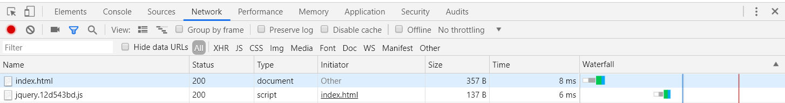

返回 200 ，无缓存。

### 强制缓存

对于强制缓存来说， `Response Headers` 中会有两个字段来标明失效规则( `Expires` 或者 `Cache-Control` )

**1. `Expires`**

通过 `Expires` ，设置20000 毫秒后过期。

```js
function send (req, res, file) {
  // 20000 毫秒后过期
  res.setHeader('Expires', new Date(Date.now() + 20000).toGMTString());
  res.end(readFile(file));
}
```

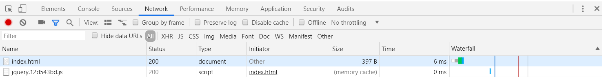
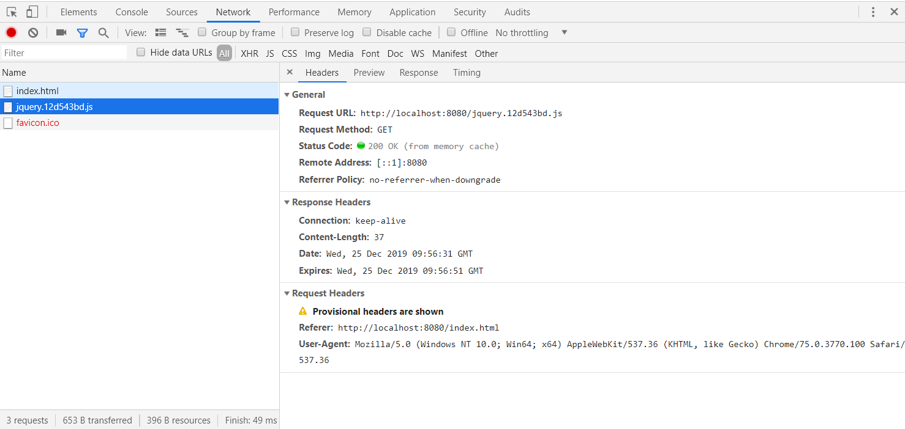

**2. `Cache-Control`**

该字段表示资源缓存的最大有效时间，在该时间内，客户端不需要向服务器发送请求。

```js
function send (req, res, file) {
  // 4 秒后过期
  res.setHeader('Cache-Control', 'max-age=4');
  res.end(readFile(file));
}
```
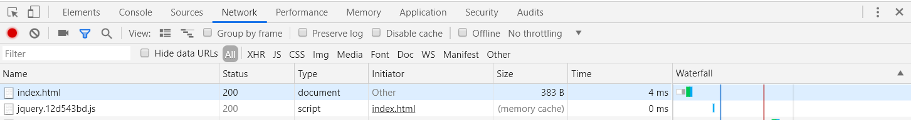
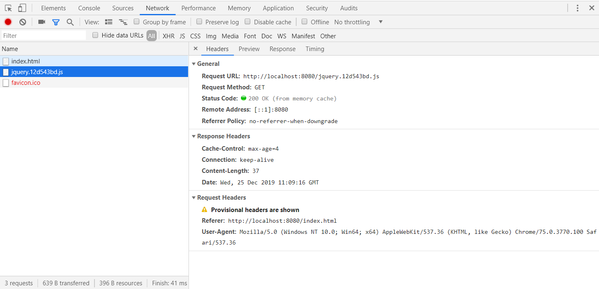

### 协商缓存（对比缓存）

**1. `Last-Modified`**

服务器在响应头中设置 `Last-Modified` 字段返回给客户端。

服务器收到请求头的 `if-modified-since` 的值与 `Last-Modified` 的值比较，如果相等，表示未进行修改，则返回状态码为 304；如果不相等，则修改了，返回状态码为 200，并返回数据。

```js
http.createServer(function (req, res) {
  var file = path.join(__dirname, req.url);

  fs.stat(file, function (err, stat) {
    if (err) {
      sendError(err, req, res, file, stat);
    } else {
      var IfModifiedSince = req.headers['if-modified-since'];
      if (IfModifiedSince) {
        if (IfModifiedSince == stat.ctime.toGMTString()) {
          res.statusCode = 304;
          res.end();
        } else {
          send(req, res, file, stat);
        }
      } else {
        send(req, res, file, stat);
      }
    }
  });
}).listen(8080, function () {
  console.log('listen to 8080 port');
});

function send (req, res, file, stat) {
  res.setHeader('Last-Modified', stat.ctime.toGMTString());
  res.end(readFile(file));
}
```

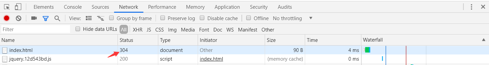
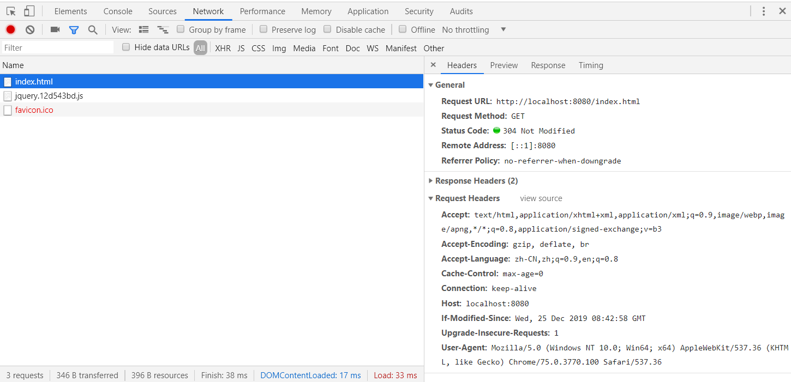

`Last-Modified` 的缺点：

1、 `Last-Modified` 是以秒为单位的，假如资料在1s内可能修改几次，那么该缓存就不能被使用的。

2、如果文件是通过服务器动态生成，那么更新的时间永远就是生成的时间，尽管文件可能没有变化，所以起不到缓存的作用。

**2. `ETag`**

为了解决上述问题，出现了一组新的字段 `ETag` 与 `If-None-Match` 

`ETag` 是根绝文件内容，算出一个唯一的值。服务器存储着文件的 `ETag` 字段。之后的流程和 `Last-Modified` 一致，只是 `Last-Modified` 字段和它所表示的更新时间改变成了 `ETag` 字段和它所表示的文件hash，把 `if-modified-since` 变成了 `If-None-Match` 。服务器同样进行比较，命中返回 304, 不命中返回新资源和 200。 `ETag` 的优先级高于 `Last-Modified` 

```js
http.createServer(function (req, res) {
  var file = path.join(__dirname, req.url);

  fs.stat(file, function (err, stat) {
    if (err) {
      sendError(err, req, res, file, stat);
    } else {
      var IfNoneMatch = req.headers['if-none-match'];
      var etag = crypto.createHash('sha1').update(stat.ctime.toGMTString() + stat.size).digest('hex');
      if (IfNoneMatch) {
        if (IfNoneMatch == etag) {
          res.statusCode = 304;
          res.end();
        } else {
          send(req, res, file, etag);
        }
      } else {
        send(req, res, file, etag);
      }
    }
  });
}).listen(8080, function () {
  console.log('listen to 8080 port');
});

function send (req, res, file, etag) {
  res.setHeader('ETag', etag);
  res.end(readFile(file));
}
```

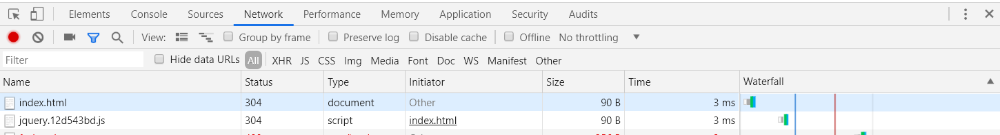

`ETag` 的缺点：

1、每次请求的时候，服务器都会把index.html 读取一次，以确认文件有没有修改。

2、对大文件进行 `ETag` 一般用文件的大小 + 文件的最后修改时间来组合生成这个 `ETag` 。

<!-- 

**缓存命中、未命中及再验证**

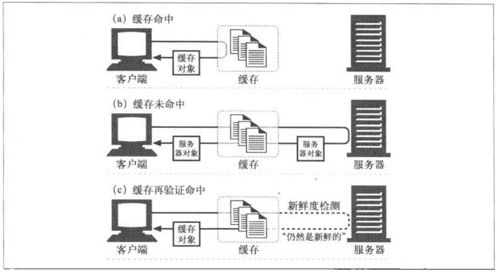

已有的副本为某些到达缓存的请求提供服务，这被称为缓存命中（cache-hit）。

一些到达缓存的请求可能会由于没有副本可用，而被转发给原始服务器，这被称为缓存未命中（cache-miss）。

**再验证**

原始服务器的内容可能会发生变化，缓存要不时的对其进行检测，看看它们保存的副本是否仍是服务器上最新的副本。这些“新鲜度检测”被称为HTTP再验证（revalidation）。

缓存对缓存的副本进行再验证时，会向原始服务器发送一个小的再验证请求。如果内容没有变化，服务器会以一个小的 `304 Not Modified` 进行响应。

只要缓存知道副本仍然有效，就会再次将副本标识为暂时新鲜的，并将副本提供给客户端，这杯称为再验证命中（revalidation hit）或缓慢缓慢命中（slow hit），这种方式确实要与原始服务器进行核对，所以要比单纯的缓存命中要慢，但它没有从原始服务器中获取对象数据，所以要比缓存未命中要快一些。

HTTP为我们提供了几个用来对已缓存对象进行再验证的工具，但最常用的是 `If-Modified-Since` 首部。将这个首部添加到请求中去，就可以告诉服务器，只有在缓存了对象的副本之后，又对其进行修改了情况下，才发送此对象。这里列出了在3种情况下（服务器内容未被修改，服务器内容已被修改，或者服务器上的对象被删除了）服务器收到请求时会发生的情况：

1、再验证命中

如果服务器对象未被修改，服务器会向客户端发送一个小的HTTP `304 Not Modified` 的响应。

2、再验证未命中

如果服务器对象与缓存副本不同服务器会向客户端发送一条普通的、带有完整内容的HTTP `200 oK` 响应。

3、对象被删除

如果服务器对象已经被删除了，服务器就会回送一个 `404 NOT Found` 响应，缓存也会将其副本删除。

**区分命中和未命中**

HTTP 没有为用户提供一种手段来区分响应是缓存命中的，还是访问原始服务器得到的。在这两种情况下，响应码都是 `200 OK` ，说明响应有主体部分。有些商业代理缓存会在 `Via` 首部附加一些额外信息，以描述缓存中发生的情况。

客户端有一种方法可以判断响应是否来自缓存，就是使用 `Date` 首部。将响应中 `Date` 首部的值与当前时间进行比较，如果响应中的日期值比较早，客户端通常就可以认为这是一条缓存的响应。

客户端也可以通过 `Age` 首部来检测缓存的响应，通过这个首部可以分辨出这条响应的使用期。 -->

## HTTP 权威指南

下面内容摘自《HTTP权威指南》，看这个真的很枯燥...

### 缓存的处理步骤

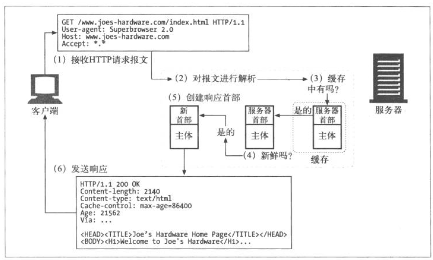

1、接收——缓存从网络中读取抵达的请求报文。

2、解析——缓存对报文进行解析，提取出URL和各种首部。

3、查询——缓存查看是否有本地副本可用，如果没有，就获取一份副本（并将其保存在本地）。

4、新鲜度检测——缓存查看已缓存副本是否足够新鲜，如果不是，就询问服务器是否有任何更新。

5、创建响应——缓存会用新的首部和已缓存的主体来构建一条响应报文。

6、发送——缓存通过网络将响应发回给客户端。

7、日志——缓存可选地创建一个日志文件来描述这个事务。

**缓存流程图**

简化形式如下图：(获取方法为GET的URL)

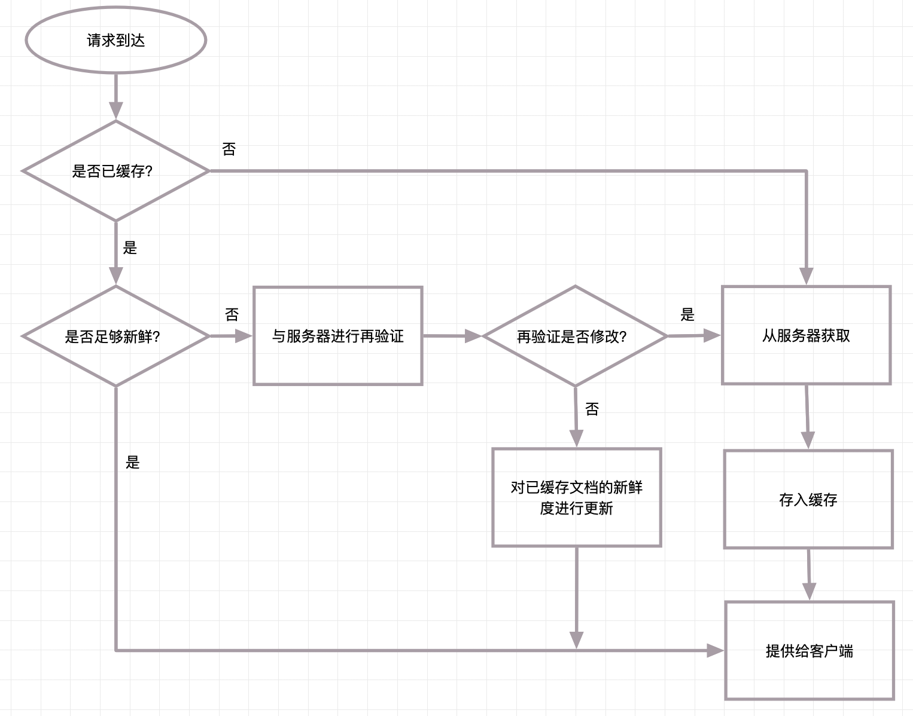

### 是否新鲜的判断

通过特殊的HTTP `Expires` 、 `Cache-Control` 首部，HTTP让原始服务器向每个文档附加了一个“过期日期”，这些首部说明了在多长时间内可以将这些内容视为新鲜的。

**`Expires`** 的值为服务端返回的到期时间，即下一次请求时，请求时间小于服务端返回的到期时间，直接使用缓存数据。这是HTTP 1.0的东西。

如： `Expires: Fri, 05 Jul 2002, 05:00:00 GMT` 拿这个时间与本地环境时间对比，可以看出这里是有问题的，因为本地时间可以随时修改，导致 `Expires` 的失效，所以目前已经基本不使用，使用 `Cache-Control` 代替。

**`Cache-Control`** 是最重要的规则，按请求和响应分类如下所示。

缓存请求指令

| 指令 | 参数 | 说明 |
| - | - | - |
| no-cache | 无 | 强制向源服务器再次验证 |
| no-store | 无 | 不缓存请求或响应的任何内容 |
| max-age = [ 秒 ] | 必需 | 响应的最大Age值 |
| max-stale( = [ 秒 ]) | 可省略 | 接收已过期的响应 |
| min-fresh = [ 秒 ] | 必需 | 期望在指定时间内的响应仍有效 |
| no-transform | 无 | 代理不可更改媒体类型 |
| only-if-cached | 无 | 从缓存获取资源 |
| cache-extension | - | 新指令标记（token） |

<br>

缓存响应指令

| 指令 | 参数 | 说明 |
| - | - | - |
| public | 无 | 可向任意方提供响应的缓存 |
| private | 可省略 | 仅向特定用户返回响应 |
| no-cache | 可省略 | 缓存前必须先确认其有效性 |
| no-store | 无 | 不缓存请求或响应的任何内容 |
| no-transform | 无 | 代理不可更改媒体类型 |
| must-revalidate | 无 | 可缓存但必须再向源服务器进行确认 |
| proxy-revalidate | 无 | 要求中间缓存服务器对缓存的响应有效性再进行确认 |
| max-age = [ 秒 ] | 必需 | 响应的最大Age值 |
| s-maxage = [ 秒 ] | 必需 | 公共缓存服务器响应的最大Age值 |
| cache-extension | - | 新指令标记（token） |

### 服务器再验证

仅仅是已缓存文档过期了并不意味着它和原始服务器上的文档有实际的区别；只意味着要到了进行核对的时间了。这种情况被称为“服务器再验证”。

HTTP定义了5个条件请求首部：

| 首部字段名 | 说明 |
| - | - |
| If-Match | 比较实体标记（ETag） |
| If-Modified-Since | 比较资源的更新时间 |
| If-None-Match | 比较实体标记（与 If-Match 相反） |
| If-Range | 资源未更新时发送实体 Byte 的范围请求 |
| If-Unmodified-Since | 比较资源的更新时间（与If-Modified-Since相反） |

<br>

最有用的有两个： `If-Modified-Since` 、 `If-None-Match` 

**`If-Modified-Since` ：Date再验证**

通常被称为IMS请求，只有与自某个日期之后资源发生了变化的时候，IMS请求才会指示服务器执行请求。

> 如果自指定日期后，文档被修改了， `If-Modified-Since` 条件就为真，通常 GET 就会成功执行。携带新首部的新文档会被返回给缓存，新首部除了其他信息之外，还包含了一个新的过期日期。
> 
> 如果自指定日期后，文档没被修改过，条件就为假，会向客户端返回一个小的 `304 Not Modified` 响应报文，为了提高有效性，不会返回文档的主体。这些首部是放在响应中返回的，但只会返回那些需要在源端更新的首部。比如 `Content-Type` 首部通常不会被修改，所以通常不需要发送。一般会发送一个新的过期日期。

`If-Modified-Since` 首部可以与 `Last-Modified` 服务器响应首部配合工作。原始服务器会将最后的修改日期附加到所提供的文档上去。当缓存要对已缓存文档进行再验证时，就会包含一个 `If-Modified-Since` 首部，其中携带有最后修改已缓存副本的日期： `If-Modified-Since: <cached last-modified date>` 。如果在此期间内容被修改了，最后的修改日期就会有所不同，原始服务器就会回送新的文档。否则服务器会注意到缓存的最后修改日期与服务器文档当前的最后修改日期相符，会返回一个 `304 Not Modified` 响应。

**`If-None-Match` ：实体标签再验证**

有些情况下仅使用最后修改日期进行再验证是不够的。比如下面几种情况：

> 有些文档可能会被周期性地重写（比如从一个后台进程中写入），但实际包含的数据常常是一样的。尽管内容没有变化，但修改日期会发生变化。
> 
> 有些文档可能被修改了，但所做修改并不重要，不需要让世界范围内的缓存都重装数据（比如对拼写或注释的修改）。
> 
> 有些服务器无法准确地判定其页面的最后修改日期。
> 
> 有些服务器提供的文档会在亚秒间隙发生变化（比如实时监视器），对这些服务器来说，以一秒为粒度的修改日期可能就不够用了。

为了解决这些问题，HTTP 允许用户对被称为实体标签（ETag）的“版本标识符”进行比较。实体标签是附加到文档上的任意标签（引用字符串）。它们可能包含了文 档的序列号或版本名，或者是文档内容的校验和及其他指纹信息。当发布者对文档进行修改时，可以修改文档的实体标签来说明这个新的版本。这样，如果实体标签被修改了，缓存就可以用 `If-None-Match` 条件首部来GET文档的新副本了。


