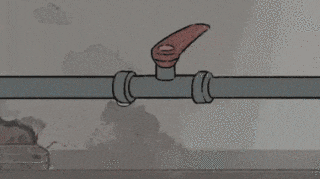
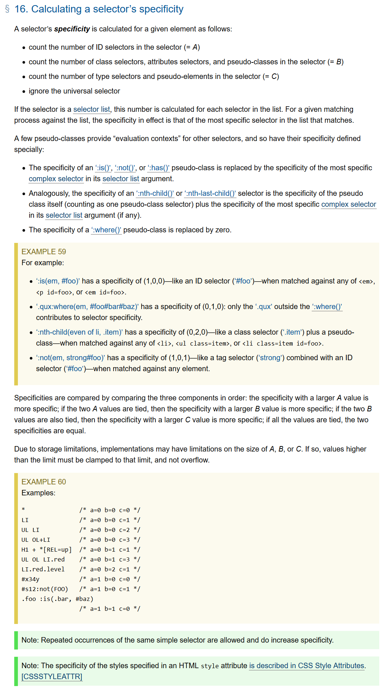
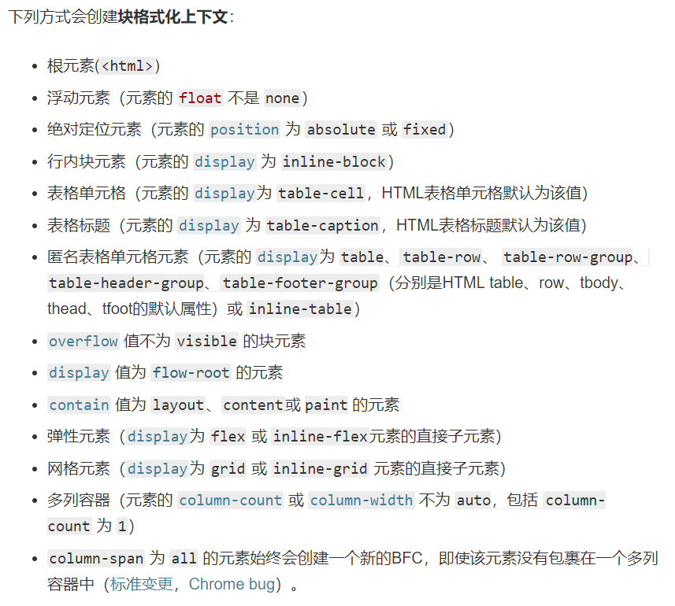

相信大部分人刚开始写 `css` 的时候应该碰到过这样的问题。

明明只改了一行样式，然后整个页面就变成了这样↓



<!-- 在前端中， `css` 也是最容易被忽视的部分。 -->

本来想写成 `css` 使用大全，加上诸如 `position不同值之间的含义、display有多少值、左侧自适应的八种方式之类` 。写完才发现，把css权重、BFC、盒模型的底层写清楚就不错了。

如果有发现没有写全的地方，欢迎来评论区补充，一起交流吧！

<!-- 本文将小节一下 `css` 的优先级，帮助解决碰到的样式重叠 优先度问题，这部分也是面试中常出现的考题。 -->

## css优先级

### 选择器类型

要搞清楚选择器的优先级，先列举下所有选择器

**选择器类型**

1. ID 选择器，如 `#id`

2. 类选择器，如 `.class`

3. 属性选择器，如 `[type="input"]`

4. 伪类选择器，如 `:hover`

5. 标签选择器(类型选择器)，如 `div`

6. 伪元素选择器，如 `::before`

7. 通配选择符 `*{}` 、 关系选择符 `(+,>,~,' ',||)` 、 否定伪类 `(:not())`

> 摘自 `css 优先级|MDN` [https://developer.mozilla.org/zh-CN/docs/Web/CSS/Specificity](https://developer.mozilla.org/zh-CN/docs/Web/CSS/Specificity)

### 优先级

优先级按从高到低依次为：

1. `!important` 例外规则。当在一个样式声明中使用一个 `!important` 规则时，此声明将覆盖任何其他声明。

2. 内联样式

3. ID 选择器

4. 类选择器、属性选择器、伪类选择器

5. 类型选择器(标签选择器)、伪元素选择器

6. 通配选择符

### 计算方式

参考 W3C ：

[https://www.w3.org/TR/selectors/#specificity](https://www.w3.org/TR/selectors/#specificity)



翻译一下，就是把 `ID 选择器` 当作 **A** ，把 `类选择器、属性选择器、伪类选择器` 当作 **B** ，把 `类型选择器(标签选择器)、伪元素选择器` 当作 **C** 再计算。

如果选择器是一个选择器列表，则累加。

`*{}` 是通配选择符，表示 `(0,0,0)` 

`ul li{}` 有两个标签选择器，所以表示 `(0,0,2)` 

`ul ol+li` 有三个标签选择器，表示 `(0,0,3)` 

`ul ol li.red` 有三个标签选择器和一个类选择器，所以表示 `(0,1,3)` 

`:not(em, strong#foo)` 有一个ID 选择器和一个标签选择器，所以表示 `(1,0,1)` 

其他就不一一介绍了。。。

举个实际例子

```html
<a href="javascript:void(0);" class="box">button</a>
<style>
  a.box {
    background: blue;
  }
  a[href] {
    background: red;
  }
</style>
<!-- [href] 和 .box 按照上面的计算方式，同属于 (0,1,0) ，所以权重相等。谁在下面就覆盖上面的样式，这里 a[href] 在下面，所以背景为红色。 -->
```

### 错误的说法

在学习过程中，你可能发现给选择器加权值的说法，即 ID 选择器权值为 100，类选择器权值为 10，标签选择器权值为 1，当一个选择器由多个 ID 选择器、类选择器或标签选择器组成时，则将所有权值相加，然后再比较权值。这种说法其实是有问题的。比如一个由 11 个类选择器组成的选择器和一个由 1 个 ID 选择器组成的选择器指向同一个标签，按理说 110 > 100，应该应用前者的样式，然而事实是应用后者的样式。错误的原因是： **选择器的权值不能进位** ，应该按照上面给的计算公式计算。

> 实战：【30个你必须记住的CSS选择符】 [https://zhuanlan.zhihu.com/p/22341291](https://zhuanlan.zhihu.com/p/22341291)

## BFC

> **块格式化上下文（Block Formatting Context，BFC）** 是Web页面的可视化CSS渲染的一部分，是块盒子的布局过程发生的区域，也是浮动元素与其他元素交互的区域。

创建块格式化上下文的方式：

> 摘自 块格式化上下文|MDN [https://developer.mozilla.org/zh-CN/docs/Web/Guide/CSS/Block_formatting_context](https://developer.mozilla.org/zh-CN/docs/Web/Guide/CSS/Block_formatting_context)



> 注意， `display` 为 `table` 等不会创建新的 BFC ，只会创建一个匿名框，匿名框中的 `display: table-cell` 创建新的 BFC 。

### BFC 特性及应用

1、同一个 BFC 下外边距会发生折叠

```html
<style>
  div {
    width: 100px;
    height: 100px;
    background: red;
    margin: 100px;
  }
</style>

<!-- 两个 div 元素都处于同一个 BFC 容器下 (这里指 body 元素) 所以第一个 div 的下边距和第二个 div 的上边距发生了重叠，两个盒子之间距离只有 100px，而不是 200px -->

<body>
  <div></div>
  <div></div>
</body>

<!-- 这不是 CSS 的 bug，我们可以理解为一种规范，如果想要避免外边距的重叠，可以将其放在不同的 BFC 容器中 -->
```

2、BFC 可以包含浮动的元素(清除浮动）

```html
<!-- 由于容器内元素浮动，脱离了文档流，所以容器只剩下 2px 的边距高度。如果使触发容器的 BFC，那么容器将会包裹着浮动元素 -->
<div style="border: 1px solid #000;">
  <div style="width: 100px;height: 100px;background: red;float: left;"></div>
</div>

<!-- 下面我们将其清除浮动触发BFC,将可包裹浮动元素 -->

<div style="border: 1px solid #000;overflow:hidden">
  <div style="width: 100px;height: 100px;background: red;float: left;"></div>
</div>
```

3、BFC 可以阻止元素被浮动元素覆盖

这里有一个经典的css布局试题(两列自适应布局)就是应用的BFC特性。

```html
<div style="float:left; width:200px; background:blue">left</div>
<div style="height:100%; background: red">right</div>
```

### 脱离常规流的方式

> 摘自 In Flow and Out of Flow|MDN [https://developer.mozilla.org/zh-CN/docs/Web/CSS/CSS_Flow_Layout/在Flow中和Flow之外](https://developer.mozilla.org/zh-CN/docs/Web/CSS/CSS_Flow_Layout/在Flow中和Flow之外)

1、设置为浮动 `float` 

2、设置 `position` 属性为 `absolute` 或者 `fixed` 

3、根元素( `html` )

脱离常规流的元素会创建一个新的块级格式化上下文（Block Formatting Context: BFC）环境，其中包含的所有元素构成了一个小的布局环境，与页面中的其他内容分隔开来。而根元素，作为页面中所有内容的容器，自身脱离常规流，为整个文档创建了一个块级格式化上下文环境。

> 对于脱离常规流的元素， BFC 在计算高度时只会包含浮动元素，不包含 `position` 属性为 `absolute` 或者 `fixed` 的元素。
> 
> 参考 w3c [https://www.w3.org/TR/CSS2/visudet.html#root-height](https://www.w3.org/TR/CSS2/visudet.html#root-height)
> 
> In addition, if the element has any floating descendants whose bottom margin edge is below the element's bottom content edge, then the height is increased to include those edges. Only floats that participate in this block formatting context are taken into account, e.g., floats inside absolutely positioned descendants or other floats are not.

**区分清除浮动和闭合浮动**

清除浮动仅仅是指 `clear: both` 

闭合浮动是指创建一个新的 BFC （即原来浮动元素浮动之前的包含块）包含清除浮动的元素，使其浮动元素被新的 BFC 计算高度，恢复 BFC 的正常高度计算。常用方法是在浮动元素的父元素添加一个 `.clearfix` 类来闭合浮动。

```css
.clearfix::after {
  display: block;
  content: '.'; /* 点的兼容性优于空格 */
  height: 0;
  line-height: 0;
  clear: both;
  visibility: hidden;
}
```

原理： `::after` 伪元素表示创建被选择元素的排在最后的一个子元素。以上代码创建了一个块级元素区域（防止影响包含块中的普通流布局）表示两边清除浮动。因为清除了浮动，那么伪元素将排在浮动元素之下。这样达到一种将浮动元素的位置空出来的效果。对于外层的包含块 `.clearfix` 的普通流虽然只包含了 `::after` ，但因有 `::after` 空出位置， `.clearfix` 这时也就间接计算了内部浮动子元素的高度，也就相当于闭合了内部的浮动。

总结：闭合浮动是效果，效果是浮动元素重新被计算高度（W3C 计算 BFC 中元素高度）。清除浮动仅仅是清除了浮动，决定其他非浮动元素的布局。清除浮动仅仅只是闭合浮动的一种方法中的一个步骤。

## 盒模型

当对一个文档进行布局（lay out）的时候，浏览器的渲染引擎会根据标准之一的 CSS 基础框盒模型（CSS basic box model），将所有元素表示为一个个矩形的盒子（box）。

每个盒子由四个部分（或称区域）组成，其效用由它们各自的边界（Edge）所定义（原文：defined by their respective edges，可能意指容纳、包含、限制等）。如图，与盒子的四个组成区域相对应，每个盒子有四个边界：内容边界 Content edge、内边距边界 Padding Edge、边框边界 Border Edge、外边框边界 Margin Edge。


> 摘自 CSS 基础框盒模型介绍|MDN [https://developer.mozilla.org/zh-CN/docs/Web/CSS/CSS_Box_Model/Introduction_to_the_CSS_box_model](https://developer.mozilla.org/zh-CN/docs/Web/CSS/CSS_Box_Model/Introduction_to_the_CSS_box_model)
> 
> 摘自 w3c 盒模型 [https://www.w3.org/TR/CSS21/box.html](https://www.w3.org/TR/CSS21/box.html)

有两种盒模型： **W3C盒模型(标准盒模型)和IE盒模型**

这两种盒模型，主要区别是在解释元素的 `width` 和 `height` 属性上。

**W3C盒模型** 认为：元素的 `width` 和 `height` 属性仅仅指 `content area` 。

`Total element width = width + left padding + right padding + left border + right border + left margin + right margin`

**IE盒模型** 认为：元素的 `width` 和 `height` 属性由 `content area` + `padding` + `border` 组成。

`Total element width = left margin + width + right margin`

在IE5.5和以及更早的IE版本中，IE都采用了IE盒模型，从IE6开始提供了一种IE使用W3C盒模型的方式：在 `html` 中声明 `Doctype` 。但是，IE6默认的仍旧是IE盒模型( `quirks model` 模式)。

其实， IE盒模型更符合人们的思考方式，所以W3C在 `css3.0` 中加入了 `box-sizing` ，用来修改css box model，默认值是 `content-box` (W3C的盒子)， `border-box` 值设置IE盒子。

