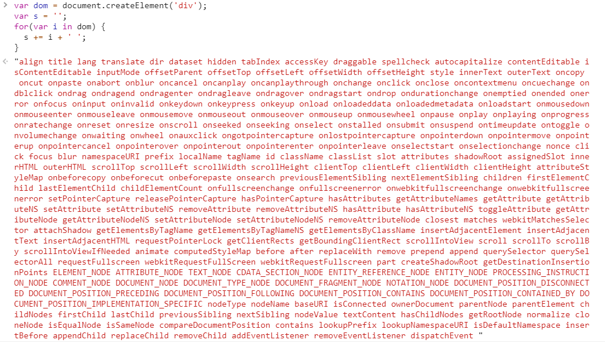
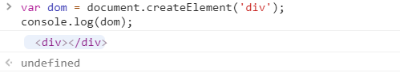
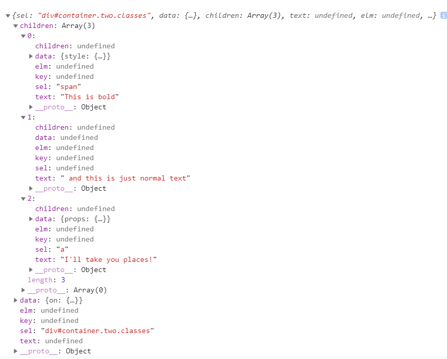

# snabbdom

## `Virtual DOM`

高性能JavaScript中很重要的一条就是减少DOM操作。打开一个DOM



可以看到浏览器对DOM的设计非常复杂。少数还好，当我们要对上千甚至上万的DOM进行操作时就肯定会导致浏览器卡死。

在浏览器中打印一个真实DOM为



而虚拟DOM则是通过数据的形式，先描述出这个DOM的特征：

```js
var vnode = {
  sel: "div#container.two.classes", // string类型 代表虚拟节点
  data: {"on": {"click": undefined}}, // Object类型 为虚拟节点信息，比如样式、css类、属性等
  children: [], // Array类型 代表虚拟节点的子节点
  text: undefined, // 字符串或者undefined类型 当且仅当节点是个文本节点时，text有值
  elm: undefined, // Element类型 指向snabbdom创建的实际DOM节点的指针
  key: undefined, // string | number类型 用于保存指向以前存在的DOM节点的指针，以避免不必要时重新创建它们。这对于列表重新排序之类的事情非常有用。键必须是字符串或数字，以便进行适当的查找，因为它作为键/值对存储在对象内部，其中.key是键，值是.elm属性创建的
}
```

**实现一个虚拟DOM，我们一般有如下三个步骤需要完成：**

1、 `compile` 把真实的DOM编译成vnode

2、 `diff` 比较oldVnode和newVnode之间的不同

3、 `patch` 通过第二步的比较知道不同点，然后把不同的虚拟DOM渲染到真实的DOM上去

## `snabbdom` 实现

> 当前参考的是tag： `v0.5.4` 版本
> 
> https://github.com/snabbdom/snabbdom/tree/v0.5.4

 `dist/snabbdom.js` 才300多行比较少，包含三部分： `h函数` 、 `vnode对象` 、 `patch方法` 。

### `h函数`

```js
/**
 * @param sel 虚拟节点
 * @param b 节点属性
 * @param c 子节点
 */
module.exports = function h(sel, b, c) {
  var data = {}, children, text, i;
  if (c !== undefined) {
    data = b;
    if (is.array(c)) { children = c; }
    else if (is.primitive(c)) { text = c; }
  } else if (b !== undefined) {
    if (is.array(b)) { children = b; }
    else if (is.primitive(b)) { text = b; }
    else { data = b; }
  }
  if (is.array(children)) {
    for (i = 0; i < children.length; ++i) {
      if (is.primitive(children[i])) children[i] = VNode(undefined, undefined, undefined, children[i]);
    }
  }
  // svg 单独处理
  if (sel[0] === 's' && sel[1] === 'v' && sel[2] === 'g') {
    addNS(data, children, sel);
  }
  return VNode(sel, data, children, text, undefined);
};
```

**内联例子**

```html
<script src="./dist/h.js"></script>

<script>
  var vnode = h('div#container.two.classes', { on: { click: console.log(11) } }, [
    h('span', { style: { fontWeight: 'bold' } }, 'This is bold'),
    ' and this is just normal text',
    h('a', { props: { href: '/foo' } }, 'I\'ll take you places!')
  ]);

  console.log(vnode);
</script>
```

打印如下：



可以看出 `h函数` 只是将按要求输入的数据格式稍做处理，方便 `VNode()` 函数将其转化成虚拟DOM的格式。

### `vnode对象`

需要注意的是，如果 `text` 有值就代表这是一个文本节点。

```js
module.exports = function(sel, data, children, text, elm) {
  var key = data === undefined ? undefined : data.key;
  return {sel: sel, data: data, children: children,
          text: text, elm: elm, key: key};
};
```

同上


### `patch方法`

 `patch` 有两种用法：

```js
patch(container, vnode) // container为容器DOM元素
patch(vnode, newVnode) // 两个vnode的比较
```

**示例**

```html
<script src="./dist/h.js"></script>
<script src="./dist/snabbdom.js"></script>

<div id="container"></div>
<script>
  var container = document.getElementById('container');
  var patch = snabbdom.init([]);

  var vnode = h('div#container.one.classes', { on: { click: function () { } } }, [
    // h('span', { style: { fontWeight: 'bold' } }, 'This is bold'),
    // ' and this is just normal text',
    // h('a', { props: { href: '/foo' } }, 'I\'ll take you places!')
  ]);

  patch(container, vnode);

  var newVnode = h('div#container.two.classes', { on: { click: function () { } } }, [
    // h('span', { style: { fontWeight: 'normal', fontStyle: 'italic' } }, 'This is now italic type'),
    // ' and this is still just normal text',
    // h('a', { props: { href: '/bar' } }, 'I\'ll take you places!')
  ]);

  // patch(vnode, newVnode);
</script>
```

**`init`** 函数：

```js
function init(modules, api) {
  return function(oldVnode, vnode) {
    // 省略一些对钩子、周期的处理...

    // 省略一些sel为空的处理...

    if (sameVnode(oldVnode, vnode)) {
      patchVnode(oldVnode, vnode, insertedVnodeQueue);
    } else {
      elm = oldVnode.elm;
      parent = api.parentNode(elm);

      createElm(vnode, insertedVnodeQueue);

      if (parent !== null) {
        api.insertBefore(parent, vnode.elm, api.nextSibling(elm));
        removeVnodes(parent, [oldVnode], 0, 0);
      }
    }

    // 省略一些对钩子、周期的处理...
    
    return vnode;
  }
}
```

**`sameVnode`** 函数，比较两个 `vnode` 是否相等。比较的方式就是 `vnode1.key === vnode2.key && vnode1.sel === vnode2.sel` ，我们在 `vue` 、 `react` 中常说到的 `key` 可以加快 `vnode` 计算就来源于这里，可以减少DOM操作。

如果两个 `vnode` 相等，则进入 `patchVnode` ；如果不相等（如：从 `div` 变成了 `span` 或者 `key` 改变），意味着整个 `vnode` 被替换，因为我们通常不会去跨层移动 `vnode` 所以没有必要再去比较，直接调用创建DOM的函数 `createElm` 。

<!-- **钩子**

```js
var hooks = ['create', 'update', 'remove', 'destroy', 'pre', 'post'];
``` -->

**`patchVnode`** 函数：

通过diff算法实现两颗虚拟DOM树的最小更新。

```js
function patchVnode(oldVnode, vnode, insertedVnodeQueue) {
  // 一些钩子
  var i, hook;
  if (isDef(i = vnode.data) && isDef(hook = i.hook) && isDef(i = hook.prepatch)) {
    i(oldVnode, vnode);
  }
  // 因为上一层已经通过 sameVnode 函数比较两个 vnode 是相等的了，所以这里直接赋值
  var elm = vnode.elm = oldVnode.elm, oldCh = oldVnode.children, ch = vnode.children;
  if (oldVnode === vnode) return;
  // 跟 init 函数中的一样，如果不是相同的 vnode 则节点没有对比的必要，直接创建DOM
  if (!sameVnode(oldVnode, vnode)) {
    var parentElm = api.parentNode(oldVnode.elm);
    elm = createElm(vnode, insertedVnodeQueue);
    api.insertBefore(parentElm, elm, oldVnode.elm);
    removeVnodes(parentElm, [oldVnode], 0, 0);
    return;
  }
  // update 钩子
  if (isDef(vnode.data)) {
    for (i = 0; i < cbs.update.length; ++i) cbs.update[i](oldVnode, vnode);
    i = vnode.data.hook;
    if (isDef(i) && isDef(i = i.update)) i(oldVnode, vnode);
  }
  // vnode.text 有值则为文本节点
  if (isUndef(vnode.text)) {
    if (isDef(oldCh) && isDef(ch)) {
      // 1、比较 old children 和 new children 不相等则更新
      if (oldCh !== ch) updateChildren(elm, oldCh, ch, insertedVnodeQueue);
    } else if (isDef(ch)) {
      // 2、如果只有 new children 则往下加DOM
      if (isDef(oldVnode.text)) api.setTextContent(elm, '');
      addVnodes(elm, null, ch, 0, ch.length - 1, insertedVnodeQueue);
    } else if (isDef(oldCh)) {
      // 3、如果只有 old children 则移除 vnode
      removeVnodes(elm, oldCh, 0, oldCh.length - 1);
    } else if (isDef(oldVnode.text)) {
      // 4、vnode.text 有值则为文本节点
      api.setTextContent(elm, '');
    }
  } else if (oldVnode.text !== vnode.text) {
    api.setTextContent(elm, vnode.text);
  }
  if (isDef(hook) && isDef(i = hook.postpatch)) {
    i(oldVnode, vnode);
  }
}
```

**`updateChildren`** 函数：

这里是最核心逻辑，比较新旧children并更新。

```js
/**
 * 1、优先处理特殊场景，先对比两端。也就是
 *    旧 vnode 头 vs 新 vnode 头
 *    旧 vnode 尾 vs 新 vnode 尾
 *    旧 vnode 头 vs 新 vnode 尾
 *    旧 vnode 尾 vs 新 vnode 头
 * 2、首尾不一样的情况，寻找 key 相同的节点，找不到则新建元素
 * 3、如果找到 key，但是，元素选择器变化了，也新建元素
 * 4、如果找到 key，并且元素选择没变， 则移动元素
 * 5、两个列表对比完之后，清理多余的元素，新增添加的元素
 * 
 * 不提供 key 的情况下，如果只是顺序改变的情况，例如第一个移动到末尾。这个时候，会导致其实更新了后面的所有元素
 */
function updateChildren(parentElm, oldCh, newCh, insertedVnodeQueue) {
  var oldStartIdx = 0, newStartIdx = 0;
  var oldEndIdx = oldCh.length - 1;
  var oldStartVnode = oldCh[0];
  var oldEndVnode = oldCh[oldEndIdx];
  var newEndIdx = newCh.length - 1;
  var newStartVnode = newCh[0];
  var newEndVnode = newCh[newEndIdx];
  var oldKeyToIdx, idxInOld, elmToMove, before;

  // 遍历 oldCh 和 newCh 
  while (oldStartIdx <= oldEndIdx && newStartIdx <= newEndIdx) {
    // 前6个if都是对 oldCh 和 newCh 的开始节点、末尾节点排列组合的方式进行比较，相同则递归
    if (isUndef(oldStartVnode)) {
      oldStartVnode = oldCh[++oldStartIdx]; // Vnode has been moved left
    } else if (isUndef(oldEndVnode)) {
      oldEndVnode = oldCh[--oldEndIdx];
    } else if (sameVnode(oldStartVnode, newStartVnode)) {
      patchVnode(oldStartVnode, newStartVnode, insertedVnodeQueue);
      oldStartVnode = oldCh[++oldStartIdx];
      newStartVnode = newCh[++newStartIdx];
    } else if (sameVnode(oldEndVnode, newEndVnode)) {
      patchVnode(oldEndVnode, newEndVnode, insertedVnodeQueue);
      oldEndVnode = oldCh[--oldEndIdx];
      newEndVnode = newCh[--newEndIdx];
    } else if (sameVnode(oldStartVnode, newEndVnode)) { // Vnode moved right
      patchVnode(oldStartVnode, newEndVnode, insertedVnodeQueue);
      api.insertBefore(parentElm, oldStartVnode.elm, api.nextSibling(oldEndVnode.elm));
      oldStartVnode = oldCh[++oldStartIdx];
      newEndVnode = newCh[--newEndIdx];
    } else if (sameVnode(oldEndVnode, newStartVnode)) { // Vnode moved left
      patchVnode(oldEndVnode, newStartVnode, insertedVnodeQueue);
      api.insertBefore(parentElm, oldEndVnode.elm, oldStartVnode.elm);
      oldEndVnode = oldCh[--oldEndIdx];
      newStartVnode = newCh[++newStartIdx];
    } else {
      // 如果 oldCh 和 newCh 都不相同：
      // 如果 oldKeyToIdx 不存在，创建 old children 中 vnode 的 key 到 index 的映射，方便我们之后通过 key 去拿下标
      if (isUndef(oldKeyToIdx)) oldKeyToIdx = createKeyToOldIdx(oldCh, oldStartIdx, oldEndIdx);
      idxInOld = oldKeyToIdx[newStartVnode.key];
      if (isUndef(idxInOld)) { // New element
        api.insertBefore(parentElm, createElm(newStartVnode, insertedVnodeQueue), oldStartVnode.elm);
        newStartVnode = newCh[++newStartIdx];
      } else {
        elmToMove = oldCh[idxInOld];
        patchVnode(elmToMove, newStartVnode, insertedVnodeQueue);
        oldCh[idxInOld] = undefined;
        api.insertBefore(parentElm, elmToMove.elm, oldStartVnode.elm);
        newStartVnode = newCh[++newStartIdx];
      }
    }
  }
  // 循环结束后，还可能存在一些未处理的 vnode 
  if (oldStartIdx > oldEndIdx) {
    before = isUndef(newCh[newEndIdx+1]) ? null : newCh[newEndIdx+1].elm;
    addVnodes(parentElm, before, newCh, newStartIdx, newEndIdx, insertedVnodeQueue);
  } else if (newStartIdx > newEndIdx) {
    removeVnodes(parentElm, oldCh, oldStartIdx, oldEndIdx);
  }
}
```

`createElm` 函数：

通过 `createElm` 创建真正的 `dom` 节点

```js
function createElm(vnode, insertedVnodeQueue) {
  var i, data = vnode.data;
  // 调用元素的 init hook
  if (isDef(data)) {
    if (isDef(i = data.hook) && isDef(i = i.init)) {
      i(vnode);
      data = vnode.data;
    }
  }
  var elm, children = vnode.children, sel = vnode.sel;
  // 如果不是注释节点
  //     如果存在选择器，会对这个选择器做解析，得到 tag、id 和 class，然后调用 createElement 或 createElementNS 来生成节点，并挂载到 vnode.elm
  //     如果存在 children，遍历所有子节点并递归调用 createElm 创建 dom，通过 appendChild 挂载到当前的 elm 上
  //     如果不存在 children 但存在 text，便使用 createTextNode 来创建文本
  //     最后调用调用元素上的 create hook 和保存存在 insert hook 的 vnode，因为 insert hook 需要等 dom 真正挂载到 document 上才会调用，这里用个数组来保存可以避免真正需要调用时需要对 vnode 树做遍历
  // 如果当前元素是注释节点，会调用 createComment 来创建一个注释节点，然后挂载到 vnode.elm
  if (isDef(sel)) {
    // Parse selector
    var hashIdx = sel.indexOf('#');
    var dotIdx = sel.indexOf('.', hashIdx);
    var hash = hashIdx > 0 ? hashIdx : sel.length;
    var dot = dotIdx > 0 ? dotIdx : sel.length;
    var tag = hashIdx !== -1 || dotIdx !== -1 ? sel.slice(0, Math.min(hash, dot)) : sel;
    elm = vnode.elm = isDef(data) && isDef(i = data.ns) ? api.createElementNS(i, tag)
                                                        : api.createElement(tag);
    if (hash < dot) elm.id = sel.slice(hash + 1, dot);
    if (dotIdx > 0) elm.className = sel.slice(dot + 1).replace(/\./g, ' ');
    if (is.array(children)) {
      for (i = 0; i < children.length; ++i) {
        api.appendChild(elm, createElm(children[i], insertedVnodeQueue));
      }
    } else if (is.primitive(vnode.text)) {
      api.appendChild(elm, api.createTextNode(vnode.text));
    }
    for (i = 0; i < cbs.create.length; ++i) cbs.create[i](emptyNode, vnode);
    i = vnode.data.hook; // Reuse variable
    if (isDef(i)) {
      if (i.create) i.create(emptyNode, vnode);
      if (i.insert) insertedVnodeQueue.push(vnode);
    }
  } else {
    elm = vnode.elm = api.createTextNode(vnode.text);
  }
  return vnode.elm;
}
```

<!-- 生命周期

| Name |	Triggered when |	Arguments to callback |
| - | - | - |
| pre |	patch过程开始 |	none |
| init |	一个虚拟节点被添加 |	vnode |
| create |	基于一个虚拟节点，一个DOM被创建 |	emptyVnode, vnode |
| insert |	一个元素被插入到DOM中 |	vnode |
| prepatch |	一个元素即将被修补（patched） |	oldVnode, vnode |
| update |	一个元素正在被更新 |	oldVnode, vnode |
| postpatch |	一个元素已经被修补完成（patched） |	oldVnode, vnode |
| destroy |	元素被直接或间接删除 |	vnode |
| remove |	元素将直接从DOM中删除 |	vnode, removeCallback |
| post |	修补（patch）过程结束 |	none | -->
