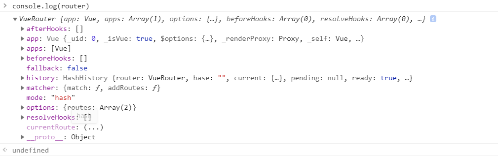
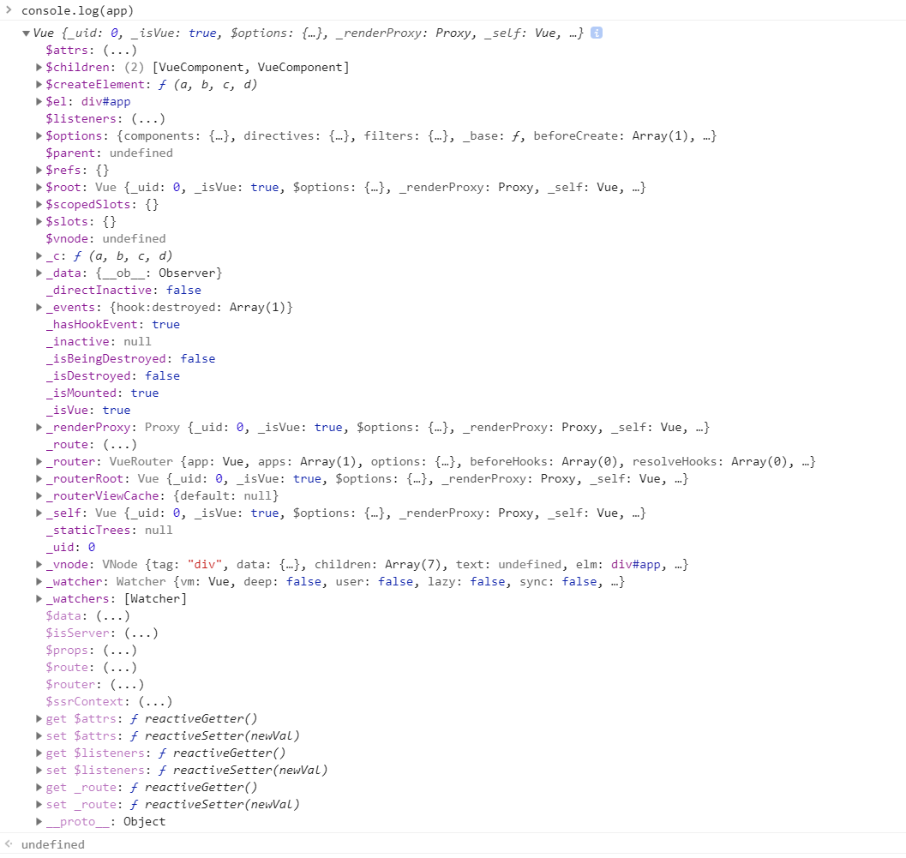
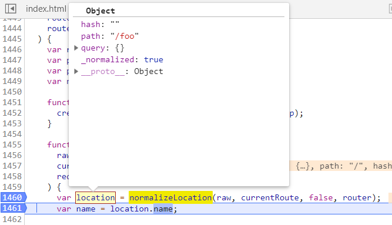
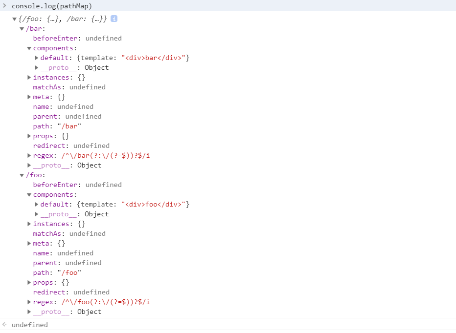
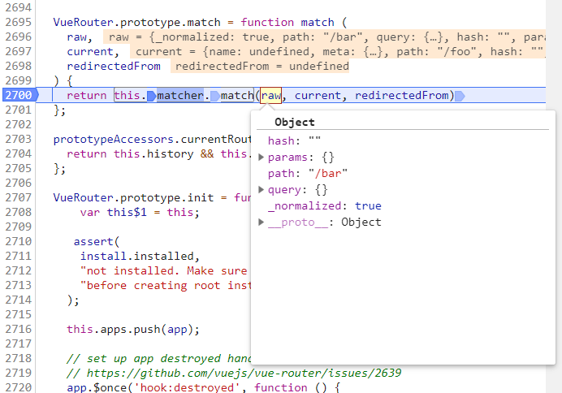
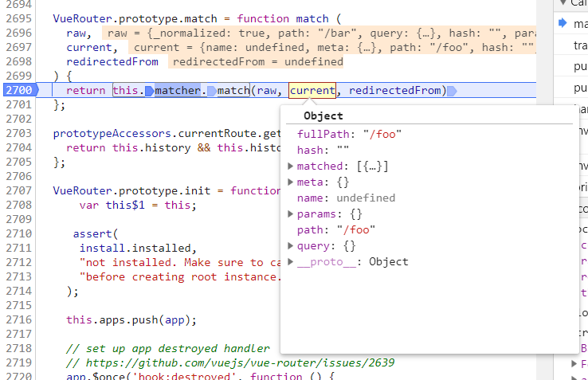
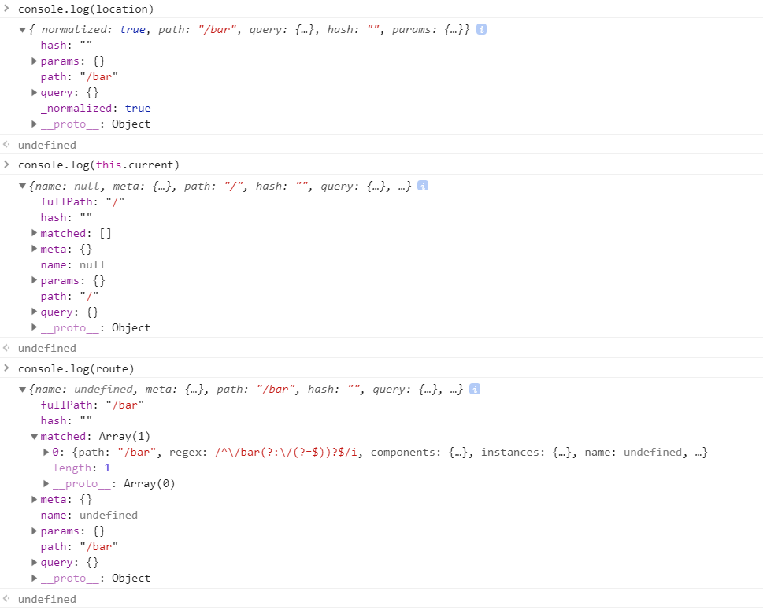

# vue-router

<!-- 网上搜了一下，发现介绍 `vue-router` 源码的文章，要不就是列文件列表介绍了一下实现思路，要不就是对某个点如： `matcher` 的详情阐述。 -->

> 参考版本： `vue-router@v3.0.1` 
> 
> https://github.com/vuejs/vue-router/tree/v3.0.1

源码在 `./src` 下，使用 `tree` 命令查看下目录结构

```
.
|-- components           // 组件(view/link)
|   |-- link.js
|   `-- view.js
|-- create-matcher.js    // Route 匹配
|-- create-route-map.js  // Route 映射
|-- history              // Router 处理 (hash模式、html5模式)
|   |-- abstract.js
|   |-- base.js
|   |-- hash.js
|   `-- html5.js
|-- index.js             // Router 入口
|-- install.js           // Router 插件安装
`-- util                 // 工具库
    |-- async.js
    |-- dom.js
    |-- location.js
    |-- params.js
    |-- path.js
    |-- push-state.js
    |-- query.js
    |-- resolve-components.js
    |-- route.js
    |-- scroll.js
    `-- warn.js
```

根据官网提供的示例： [https://router.vuejs.org/guide/#html](https://router.vuejs.org/guide/#html)

```html
<div id="app">
  <h1>Hello App!</h1>
  <p>
    <!-- 使用 router-link 组件来导航. -->
    <!-- 通过传入 `to` 属性指定链接. -->
    <!-- <router-link> 默认会被渲染成一个 `<a>` 标签 -->
    <router-link to="/foo">Go to Foo</router-link>
    <router-link to="/bar">Go to Bar</router-link>
  </p>
  <!-- 路由出口 -->
  <!-- 路由匹配到的组件将渲染在这里 -->
  <router-view></router-view>
</div>

<script>
  // 0. 如果使用模块化机制编程，导入Vue和VueRouter，要调用 Vue.use(VueRouter)

  // 1. 定义 (路由) 组件。
  // 可以从其他文件 import 进来
  const Foo = { template: '<div>foo</div>' }
  const Bar = { template: '<div>bar</div>' }

  // 2. 定义路由
  // 每个路由应该映射一个组件。 其中"component" 可以是
  // 通过 Vue.extend() 创建的组件构造器，
  // 或者，只是一个组件配置对象。
  // 我们晚点再讨论嵌套路由。
  const routes = [
    { path: '/foo', component: Foo },
    { path: '/bar', component: Bar }
  ]

  // 3. 创建 router 实例，然后传 `routes` 配置
  // 你还可以传别的配置参数, 不过先这么简单着吧。
  const router = new VueRouter({
    routes // (缩写) 相当于 routes: routes
  })

  // 4. 创建和挂载根实例。
  // 记得要通过 router 配置参数注入路由，
  // 从而让整个应用都有路由功能
  const app = new Vue({
    router
  }).$mount('#app')

  // 现在，应用已经启动了！

</script>
```

简单打印一下：





可以发现 `app.options.router` 等于 `router` 

根据官网示例，可以看出实现 `vue-router` 大概需要经过一下几步：

1、将 `VueRouter` 插件注入 `Vue` 中

2、定义 `router-link` 、 `router-view` 两个全局组件供页面跳转使用

3、传入用户自定义的 `routes` 路由映射关系

## 插件 `vue-router` 安装

`vue-router` 只是 `vue` 中的一个插件。在 `vue` 中插件的开发有这几种方式：

```js
// https://cn.vuejs.org/v2/guide/plugins.html#开发插件

MyPlugin.install = function (Vue, options) {
  // 1. 添加全局方法或属性
  Vue.myGlobalMethod = function () {
    // 逻辑...
  }

  // 2. 添加全局资源
  Vue.directive('my-directive', {
    bind (el, binding, vnode, oldVnode) {
      // 逻辑...
    }
    ...
  })

  // 3. 注入组件选项
  Vue.mixin({
    created: function () {
      // 逻辑...
    }
    ...
  })

  // 4. 添加实例方法
  Vue.prototype.$myMethod = function (methodOptions) {
    // 逻辑...
  }
}
```

#### `index.js`

先看下 `vue-router` 的入口文件 `./src/index.js` 

```js
VueRouter.install = install
VueRouter.version = '__VERSION__'

if (inBrowser && window.Vue) {
  window.Vue.use(VueRouter)
}
```

`VueRouter` 的插入方式在 `./src/install.js` 下。

先确保只安装一次

```js
// 插件安装方法
export function install (Vue) {
  if (install.installed && _Vue === Vue) return
  install.installed = true
  // ...
}
```

然后通过 `mixin` 在 `vue` 的生命周期 `beforeCreate` 内注册实例，在 `destroyed` 内销毁实例。

```js
export function install (Vue) {
  // ...
  Vue.mixin({
    beforeCreate () {
      // this.$options.router 来自于 VueRouter 的实例化，参考上面的 app = new Vue() 的打印： app.png
      // 判断实例是否已经挂载
      if (isDef(this.$options.router)) {
        this._routerRoot = this
        this._router = this.$options.router
        // 调用 VueRouter 的 init 方法
        this._router.init(this)
        Vue.util.defineReactive(this, '_route', this._router.history.current)
      } else {
        // 将每一个组件的 _routerRoot 都指向根 Vue 实例
        this._routerRoot = (this.$parent && this.$parent._routerRoot) || this
      }
      // 注册 VueComponent
      registerInstance(this, this)
    },
    destroyed () {
      // 销毁 VueComponent
      registerInstance(this)
    }
  })
  // ...
}
```

使用 `mixin` 会在每个 `.vue` 文件处进行 `beforeCreate` 和 `destroyed` 。

如在使用 `vue-cli` 创建的vue项目中，在 `HelloWorld.vue` 调用 `mixin` ，则会调用两次 `mixin` ，分别是父级 `App.vue` 和自己。

所以通过 `this._routerRoot = this` 可以将 `_routerRoot` 绑定至当前组件，即 `_routerRoot` 指向根节点。

<!-- registerInstance -->

接下来，将 `$router` 、 `$route` 挂载到 `vue` 上

```js
Object.defineProperty(Vue.prototype, '$router', {
  get () { return this._routerRoot._router }
})

Object.defineProperty(Vue.prototype, '$route', {
  get () { return this._routerRoot._route }
})
```

我们使用 `vue` 时，访问 `this.$router` 、 `this.$route` 就来源于这里。

> **提示**
> 
> 通过 `Object.defineProperty` 定义 `get` 来实现 ， 而不使用 `Vue.prototype.$router = this._routerRoot._router` 是为了让其只读，不可修改

最后，注册全局组件 `router-view` 、 `router-link` 

```js
import View from './components/view'
import Link from './components/link'

export function install (Vue) {
  // ...
  Vue.component('router-view', View)
  Vue.component('router-link', Link)
  // ...
}
```

就可以使用

```html
<router-link to="/foo">Go to Foo</router-link>
<router-link to="/bar">Go to Bar</router-link>

<router-view></router-view>
```

回到 `./src/index.js` 的 `VueRouter` 下

```js
import { HashHistory } from './history/hash'
import { HTML5History } from './history/html5'
import { AbstractHistory } from './history/abstract'

export default class VueRouter {
  // ...
  constructor (options: RouterOptions = {}) {
    // 默认是 hash 模式
    let mode = options.mode || 'hash'
    // 模式兼容处理
    this.fallback = mode === 'history' && !supportsPushState && options.fallback !== false
    if (this.fallback) {
      mode = 'hash'
    }
    if (!inBrowser) {
      mode = 'abstract'
    }
    this.mode = mode

    switch (mode) {
      case 'history':
        this.history = new HTML5History(this, options.base)
        break
      case 'hash':
        this.history = new HashHistory(this, options.base, this.fallback)
        break
      case 'abstract':
        this.history = new AbstractHistory(this, options.base)
        break
      default:
        if (process.env.NODE_ENV !== 'production') {
          assert(false, `invalid mode: ${mode}`)
        }
    }
  }
  // ...
}
```

可以看到有三种模式： `HTML5History、HashHistory、AbstractHistory` ，都来自于 `history` 目录。

<!-- 其他的， `VueRouter` 中还定义了一些方法。比如： `push` 、 `go` 等。 -->

<!-- 常用调用方式 `this.$router.push('home')` 就来自这里。 -->

### `create-matcher.js`

示例中的 `routes` 

```js
const routes = [
  { path: '/foo', component: Foo },
  { path: '/bar', component: Bar }
]

const router = new VueRouter({
  routes // (缩写) 相当于 routes: routes
})
```

来自

```js
import { createMatcher } from './create-matcher'

export default class VueRouter {
  constructor (options: RouterOptions = {}) {
    this.matcher = createMatcher(options.routes || [], this)
  }
}
```

`matcher` 来自于 `createMatcher` 的返回，初步猜测一下， `createMatcher` 是做了一个路由映射。

`./src/create-matcher.js`

```js
export function createMatcher (
  routes: Array<RouteConfig>,
  router: VueRouter
): Matcher {
  const { pathList, pathMap, nameMap } = createRouteMap(routes)

  // ...

  return {
    match,
    addRoutes
  }
}
```

`createMatcher` 接收2个参数， `routes` 来自于用户定义的配置、 `router` 是 `new VueRouter` 返回的实例，同时返回两个方法 `match` 、 `addRoutes` 。

```js
function match (
  raw: RawLocation,
  currentRoute?: Route,
  redirectedFrom?: Location
): Route {
  const location = normalizeLocation(raw, currentRoute, false, router)
  const { name } = location

  if (name) {
    const record = nameMap[name]
    if (process.env.NODE_ENV !== 'production') {
      warn(record, `Route with name '${name}' does not exist`)
    }
    if (!record) return _createRoute(null, location)
    const paramNames = record.regex.keys
      .filter(key => !key.optional)
      .map(key => key.name)

    if (typeof location.params !== 'object') {
      location.params = {}
    }

    if (currentRoute && typeof currentRoute.params === 'object') {
      for (const key in currentRoute.params) {
        if (!(key in location.params) && paramNames.indexOf(key) > -1) {
          location.params[key] = currentRoute.params[key]
        }
      }
    }

    if (record) {
      location.path = fillParams(record.path, location.params, `named route "${name}"`)
      return _createRoute(record, location, redirectedFrom)
    }
  } else if (location.path) {
    location.params = {}
    for (let i = 0; i < pathList.length; i++) {
      const path = pathList[i]
      const record = pathMap[path]
      if (matchRoute(record.regex, location.path, location.params)) {
        return _createRoute(record, location, redirectedFrom)
      }
    }
  }
  // no match
  return _createRoute(null, location)
}
```

`match` 函数逻辑如下：

1、调用 `normalizeLocation` 获取 `location` 的信息。



2、判断是否有 `name` ，有的话通过 `nameMap` 来创建 `route` 

3、判断是否有 `path` ，有的话通过 `pathMap` 来创建 `route` 

4、如果 `name` 、 `path` 都没有，则直接用 `null` 创建 `route`

`map` 是什么？

这里以 `pathMap` 举例：

```js
const routes = [
  // 有 path 没 name
  { path: '/foo', component: Foo },
  { path: '/bar', component: Bar }
]
```

`match` 之后会转换成Object形式



<!-- `match` 函数的作用是路由跳转时做检测，如从 `/foo` 跳到 `/bar` ，肯定是要做一下检测的。


 -->

```js
function addRoutes (routes) {
  createRouteMap(routes, pathList, pathMap, nameMap)
}
```

`addRoutes` 动态添加路由的方法，如： `router.addRoutes()` 

**小结一下， `createMatcher` 就是暴露出两个方法给 `VueRouter` ，需要做路由的映射以及动态添加路由的方法。**

<!-- `routes` 是一个定义了路由配置的数组，通过 `createRouteMap` 函数处理为 `pathList、pathMap、nameMap` 

```js
pathList: 路由路径数组，存储所有的path
pathMap: 路由路径与路由记录的映射表，表示一个path到RouteRecord的映射关系
nameMap: 路由名称与路由记录的映射表，表示name到RouteRecord的映射关系
``` -->

### `./src/create-route-map.js`

`create-route-map.js` 中最重要的是 `addRouteRecord` 函数

```js
function addRouteRecord (
  pathList: Array<string>,
  pathMap: Dictionary<RouteRecord>,
  nameMap: Dictionary<RouteRecord>,
  route: RouteConfig,
  parent?: RouteRecord,
  matchAs?: string
) {

  // ...

  if (route.children) {
    // ...
  }

  if (!pathMap[record.path]) {
    pathList.push(record.path)
    pathMap[record.path] = record
  }

  if (name) {
    if (!nameMap[name]) {
      nameMap[name] = record
    }
  }

  // ...

}
```

简化一下后，就是有 `path` 的时候存 `pathMap` ，有 `name` 的时候存 `nameMap` 

`record: RouteRecord` 是什么？

```js
const record: RouteRecord = {
  path: normalizedPath, // 路径
  regex: compileRouteRegex(normalizedPath, pathToRegexpOptions), // 正则匹配路径，如 { path: '/params-with-regex/:id(\\d+)' }
  components: route.components || { default: route.component }, // 对应组件
  instances: {},
  name, // 别名
  parent, // 父亲路由
  matchAs, // alias 会用到
  redirect: route.redirect, // 重定向
  beforeEnter: route.beforeEnter, // 钩子
  meta: route.meta || {},
  props: route.props == null
    ? {}
    : route.components
      ? route.props
      : { default: route.props }
}
```

即 `record` 保存着一个路由里所需的信息，比如我们可以通过路径来找到对应要渲染的组件。

如果有 **嵌套路由** 的话，即当前 route 有 children 属性的话，那就需要通过递归的方式将它们也加入映射之中。

`addRouteRecord` 的第四个参数 `parent` ，用于保存当前路由的父路由。

```js
if (route.children) {
  route.children.forEach(child => {
    const childMatchAs = matchAs
      ? cleanPath(`${matchAs}/${child.path}`)
      : undefined
    addRouteRecord(pathList, pathMap, nameMap, child, record, childMatchAs)
  })
}
```

还有就是如果有别名，如

```js
const routes = [
  {path: '/a', component: A, alias: '/ali'}
]
```

有别名的情况下， `alias` 并不会复制一份跟 `path` 一样的 `record` ，而是使用第五个参数 `matchAs` 来保存 `path` 

```js
if (route.alias !== undefined) {
  const aliases = Array.isArray(route.alias)
    ? route.alias
    : [route.alias]

  aliases.forEach(alias => {
    const aliasRoute = {
      path: alias,
      children: route.children
    }
    addRouteRecord(
      pathList,
      pathMap,
      nameMap,
      aliasRoute,
      parent,
      record.path || '/' // matchAs
    )
  })
}
```

这样，通过 `alias` 别名就能找到 `path` 路径，再通过 `path` 就能找到对应的 `record` ，从而找到对应的路由信息。

**总结**讲了这么老半天， `./src/create-matcher.js` 中的 `createMatcher` 函数与 `./src/create-route-map.js` 中的 `createRouteMap` 函数就是为了将数组 `routes` 

```js
const routes = [
  { path: '/foo', component: Foo },
  { path: '/bar', component: Bar }
]
```

转换成树形结构 `map` 

```js
map = {
  '/foo': {
    component: Foo
  },
  '/bar': {
    component: Bar
  }
}
```

再加上一个可以动态添加的函数 `addRoutes` 。

<font color=gray size=2>绕这么一大圈，不是很清楚作者为何要改成这样。一般来说本来数组的形式也是可以操作的。</font>

### `history`

**路由的两种实现方式**

**1、 `hash` 路由**

```html
<a href="#/home">首页</a>
<a href="#/about">关于</a>
<div id="html"></div>

<script>
  window.addEventListener('load', function () {
    document.getElementById('html').innerHTML = location.hash.slice(1);
  });
  window.addEventListener('hashchange', function () {
    document.getElementById('html').innerHTML = location.hash.slice(1);
  });
</script>
```

**2、 `history` 路由**

```html
<div onclick="go('/home')">首页</div>
<div onclick="go('/about')">关于</div>
<div id="html"></div>

<script>
  function go(pathname) {
    document.getElementById('html').innerHTML = pathname;
    history.pushState({}, null, pathname);
  }
  window.addEventListener('popstate', function () {
    go(location.pathname);
  });
</script>
```

> **注意**
> 
> 创建的 `html` 文件直接打开，有的浏览器执行 `history.pushState` 会报错： 
> 
> "DOMException: Failed to execute 'pushState' on 'History': A history state object with URL"
> 
> 需要创建本地环境 `localhost` 

这是两种的简易实现方式，在源码
`history` 下有四个文件，基类 `base.js` 、hash路由 `hash.js` 、html5路由 `html5.js` 、abstract模式 `abstract.js` 。

```js
export class History {
  // url 跳转
  transitionTo (location: RawLocation, onComplete?: Function, onAbort?: Function) {
    // ...
  }
  // 确认跳转
  confirmTransition (route: Route, onComplete: Function, onAbort?: Function) {
    // ...
  }
}
// 得到 base 值
function normalizeBase (base: ?string): string {
  // ...
}
// 交叉比对当前路由的路由记录和现在的这个路由的路由记录来决定调用哪些路由记录的钩子函数
function resolveQueue () {
  // ...
}
```

先介绍下基类，基类 `History` 中有个很重要的函数 `transitionTo` 。
`transitionTo` 会根据目标 `location` 与当前路径 `this.current` 进行匹配。如，从首页跳转到 `/bar` 页，执行

```js
const route = this.router.match(location, this.current)
```

`this.current` 来自

```js
import { START, isSameRoute } from '../util/route'

export class History {
  constructor (router: Router, base: ?string) {
    this.current = START
  }
}
```

```js
// ./src/util/route.js
export function createRoute (
  record: ?RouteRecord,
  location: Location,
  redirectedFrom?: ?Location,
  router?: VueRouter
): Route {
  const stringifyQuery = router && router.options.stringifyQuery

  let query: any = location.query || {}
  try {
    query = clone(query)
  } catch (e) {}

  const route: Route = {
    name: location.name || (record && record.name),
    meta: (record && record.meta) || {},
    path: location.path || '/',
    hash: location.hash || '',
    query,
    params: location.params || {},
    fullPath: getFullPath(location, stringifyQuery),
    matched: record ? formatMatch(record) : []
  }
  if (redirectedFrom) {
    route.redirectedFrom = getFullPath(redirectedFrom, stringifyQuery)
  }
  return Object.freeze(route)
}

export const START = createRoute(null, {
  path: '/'
})
```



之后调用 `confirmTransition` 函数

```js
confirmTransition (route: Route, onComplete: Function, onAbort?: Function) {
  // 路由相同则返回
  if (
    isSameRoute(route, current) &&
    route.matched.length === current.matched.length
  ) {
    this.ensureURL()
    return abort()
  }
}
```

```js
const {
  updated,
  deactivated,
  activated
} = resolveQueue(this.current.matched, route.matched)
```

`matched` 来自 `./src/util/route.js` 

```js
const route: Route = {
  // ...
  matched: record ? formatMatch(record) : []
}
```

`record` 是 `Route` 的基本单位， `formatMatch` 函数是拿 `record` 及它的所有父级组成数组。

```js
function resolveQueue (
  current: Array<RouteRecord>, // 当前页
  next: Array<RouteRecord> // 即将跳转页
): {
  updated: Array<RouteRecord>, // 相同的父级组件
  activated: Array<RouteRecord>, // 跳转页需要更新的组件
  deactivated: Array<RouteRecord> // 当前页需要更新的组件
}
```

可以理解为，比如：用上面的例子从 `/foo` 跳转到 `/bar` ，那么他的父组件是相同的不需要更新，但 `/foo` 组件需要更新（去掉）、 `/bar` 组件也需要更新（添上）。

再往下，就是官方说的“导航守卫”

```js
// 导航守卫数组
const queue: Array<?NavigationGuard> = [].concat(
  // 失活的组件钩子
  extractLeaveGuards(deactivated),
  // 全局 beforeEach 钩子
  this.router.beforeHooks,
  // 在当前路由改变，但是该组件被复用时调用
  extractUpdateHooks(updated),
  // 需要渲染组件 enter 守卫钩子
  activated.map(m => m.beforeEnter),
  // 解析异步路由组件
  resolveAsyncComponents(activated)
)
```

**1、给 `deactivated` 组件加上 `beforeRouteLeave` 钩子。**

`extractGuards` 从 `RouteRecord` 数组中提取各个阶段的守卫。 `flatMapComponents` 方法去从 `records` 中获取所有的导航。

```js
function extractGuards (
  records: Array<RouteRecord>,
  name: string,
  bind: Function,
  reverse?: boolean
): Array<?Function> {
  const guards = flatMapComponents(records, (def, instance, match, key) => {
    const guard = extractGuard(def, name)
    if (guard) {
      return Array.isArray(guard)
        ? guard.map(guard => bind(guard, instance, match, key))
        : bind(guard, instance, match, key)
    }
  })
  return flatten(reverse ? guards.reverse() : guards)
}
```

获取到 `guard` 后，还会调用 `bind` 方法把组件的实例 `instance` 作为函数执行的上下文绑定到 `guard` 上。

```js
function bindGuard (guard: NavigationGuard, instance: ?_Vue): ?NavigationGuard {
  if (instance) {
    return function boundRouteGuard () {
      return guard.apply(instance, arguments)
    }
  }
}
```

**2、添加全局 `beforeEach` 钩子。**

在 `./src/index.js` 中定义了 `beforeEach` 。当用户使用 `router.beforeEach` ，就会往 `router.beforeHooks` 添加一个钩子函数，这样 `this.router.beforeHooks` 获取的就是用户注册的全局 `beforeEach` 。

```js
beforeEach (fn: Function): Function {
  return registerHook(this.beforeHooks, fn)
}

function registerHook (list: Array<any>, fn: Function): Function {
  list.push(fn)
  return () => {
    const i = list.indexOf(fn)
    if (i > -1) list.splice(i, 1)
  }
}
```

**3、给 `updated` 组件加上 `beforeRouteUpdate` 钩子。**

与 `extractLeaveGuards(deactivated)` 相差不大。

**4、添加全局 `beforeEnter` 钩子。**

激活的路由配置中定义的 `beforeEnter` 函数。

**5、加载要被激活的异步组件。**

`resolveAsyncComponents` 返回的是一个导航守卫函数，有标准的 `to` 、 `from` 、 `next` 参数。它的内部实现很简单，利用了 `flatMapComponents` 方法从 `matched` 中获取到每个组件的定义，判断如果是异步组件，则执行异步组件加载逻辑。

这样在 `resolveAsyncComponents(activated)` 解析完所有激活的异步组件后，我们就可以拿到这一次所有激活的组件。

**6、在被激活的组件里调用 `beforeRouteEnter` 。**

**7、调用全局的 `beforeResolve` 。**

```js
beforeResolve (fn: Function): Function {
  return registerHook(this.resolveHooks, fn)
}
```

**8、导航被确认。**

**9、调用全局的 `afterEach` 。**

执行了 `onComplete(route)`  后，会执行 `this.updateRoute(route)` 方法。

**10、触发DOM更新。**

**11、用创建好的实例调用 `beforeRouteEnter` 守卫传给 `next` 的回调函数。**
```js
const iterator = (hook: NavigationGuard, next) => {
  // ...
}
```

`iterator` 函数逻辑很简单，它就是去执行每一个 导航守卫 `hook` ，并传入 `route` 、 `current` 和匿名函数，这些参数对应文档中的 `to` 、 `from` 、 `next` ，当执行了匿名函数，会根据一些条件执行 `abort` 或 `next` ，只有执行 `next` 的时候，才会前进到下一个导航守卫钩子函数中，这也就是为什么官方文档会说只有执行 `next` 方法来 `resolve` 这个钩子函数。

那么，怎么执行这些 `queue` 呢？

创建一个 `迭代器模式` 的函数

```js
function runQueue (queue, fn, cb) {
  var step = function (index) {
    if (index >= queue.length) {
      cb();
    } else {
      if (queue[index]) {
        fn(queue[index], function () {
          step(index + 1);
        });
      } else {
        step(index + 1);
      }
    }
  };
  step(0);
}
// 示例
// 可以通过是否调用 `next` 让执行随时停止。
var arr = [1,2,3];
runQueue(arr, function (a, next) {
  console.log(a, next);
  // next();
}, function () {
  console.log('callback');
});
```

<!-- 

```js
export class HashHistory extends History {
  constructor (router: Router, base: ?string, fallback: boolean) {
    // 降级处理，不支持 html5 路由要降为 hash 路由
    if (fallback && checkFallback(this.base)) {
      return
    }
    // 确保即使 hash 路由都以 '/' 开头
    ensureSlash()
  }
}
```

这样就拿到了跳转之后的路径，执行 `confirmTransition` 

```js
export class HTML5History extends History {
  // 监听浏览器历史记录发生改变，包括浏览器回退、前进按键
    window.addEventListener('popstate', e => {
      // ...
    });
}
```

`hash` 路由：

```js
// 继承基类 History
export class HashHistory extends History {
  constructor (router: Router, base: ?string, fallback: boolean) {
    super(router, base)
    // fallback 来源于 './src/index.js' : this.fallback = mode === 'history' && !supportsPushState && options.fallback !== false 检测路由能不能为 history
    if (fallback && checkFallback(this.base)) {
      return
    }
    // 判断是否有 "/#" ，没有的话通过 replaceHash 加上
    ensureSlash()
  }
}
```

```js
// 举例地址为：www.baidu.com/search#/value?id=1   base为：search
function checkFallback (base) {
  // getLocation 可以获取到之后的 "#/value?id=1"
  const location = getLocation(base)
  // 判断是否是 "/#" 开头
  if (!/^\/#/.test(location)) {
    // 因为这里是在 hash 路由内，如果没有就要加上 "/#"
    window.location.replace(
      cleanPath(base + '/#' + location)
    )
    return true
  }
}
```

可以看到 `hash` 路由的实例初始化主要是判断下能否支持 `history` 路由不支持要降级为 `hash` 路由、以及检测下路由的开头没有 `/#` 要加上。 -->

### 组件

**`<router-view>`** 组件通过 `render` 渲染。

```js
const route = parent.$route // 获取当前的路径
```

`<router-view>` 支持嵌套

```js
while (parent && parent._routerRoot !== parent) {
  if (parent.$vnode && parent.$vnode.data.routerView) {
    depth++
  }
  if (parent._inactive) {
    inactive = true
  }
  parent = parent.$parent
}
```

还记得一开始说的吗 `_routerRoot` 表示的是根 Vue 实例。

同时定义了一个注册路由实例的方法。

```js
data.registerRouteInstance = (vm, val) => {
  // val could be undefined for unregistration
  const current = matched.instances[name]
  if (
    (val && current !== vm) ||
    (!val && current === vm)
  ) {
    matched.instances[name] = val
  }
}
```

在 `./src/install.js` 中，我们会调用该方法去注册路由的实例。

```js
const registerInstance = (vm, callVal) => {
  let i = vm.$options._parentVnode
  if (isDef(i) && isDef(i = i.data) && isDef(i = i.registerRouteInstance)) {
    i(vm, callVal)
  }
}

Vue.mixin({
  beforeCreate () {
    registerInstance(this, this)
  },
  destroyed () {
    registerInstance(this)
  }
})
```

**`<router-link>`** 组件也是通过 `render` 渲染。

当我们点击 `<router-link>` 的时候，实际上最终会执行 `router.push` 。

```js
// ./src/index.js
push (location: RawLocation, onComplete?: Function, onAbort?: Function) {
  this.history.push(location, onComplete, onAbort)
}
```

我们看下 `hash` 模式下 `push` 的实现。

```js
push (location: RawLocation, onComplete?: Function, onAbort?: Function) {
  const { current: fromRoute } = this
  this.transitionTo(location, route => {
    pushHash(route.fullPath)
    handleScroll(this.router, route, fromRoute, false)
    onComplete && onComplete(route)
  }, onAbort)
}
```

执行 `transitionTo` 跳转后，调用 `pushHash` 更新浏览器的 `url` 地址，并把当前 `url` 压入历史栈中。

在 `history` 的初始化中，会设置一个监听器，监听历史栈的变化。

```js
setupListeners () {
  const router = this.router
  const expectScroll = router.options.scrollBehavior
  const supportsScroll = supportsPushState && expectScroll

  if (supportsScroll) {
    setupScroll()
  }

  window.addEventListener(supportsPushState ? 'popstate' : 'hashchange', () => {
    const current = this.current
    if (!ensureSlash()) {
      return
    }
    this.transitionTo(getHash(), route => {
      if (supportsScroll) {
        handleScroll(this.router, route, current, true)
      }
      if (!supportsPushState) {
        replaceHash(route.fullPath)
      }
    })
  })
}
```
