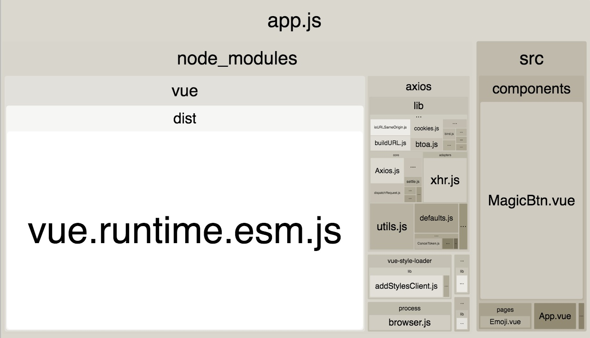
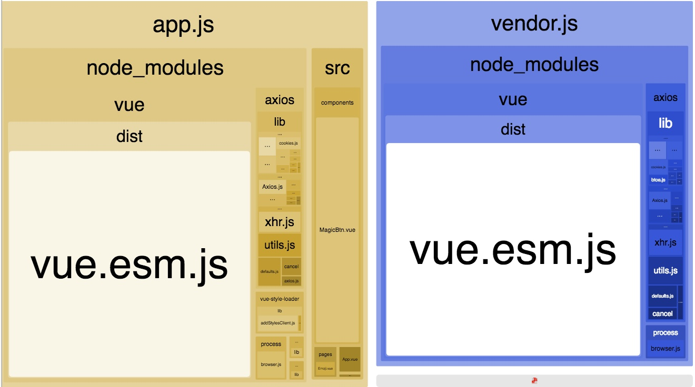
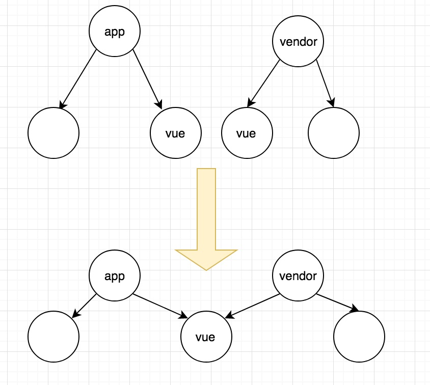
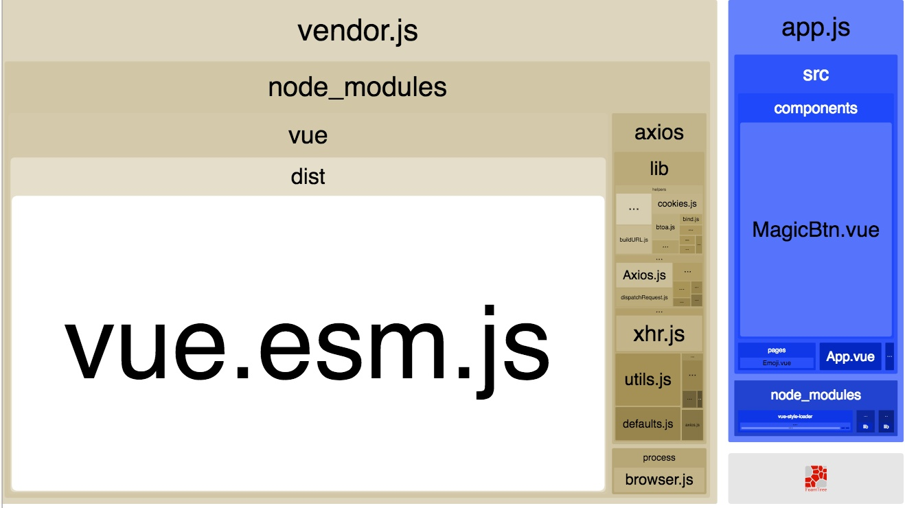
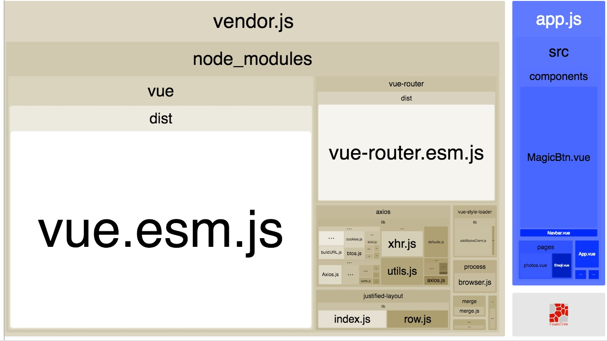
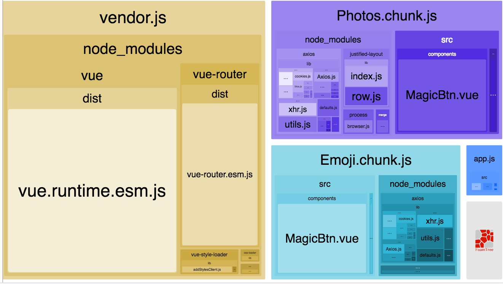
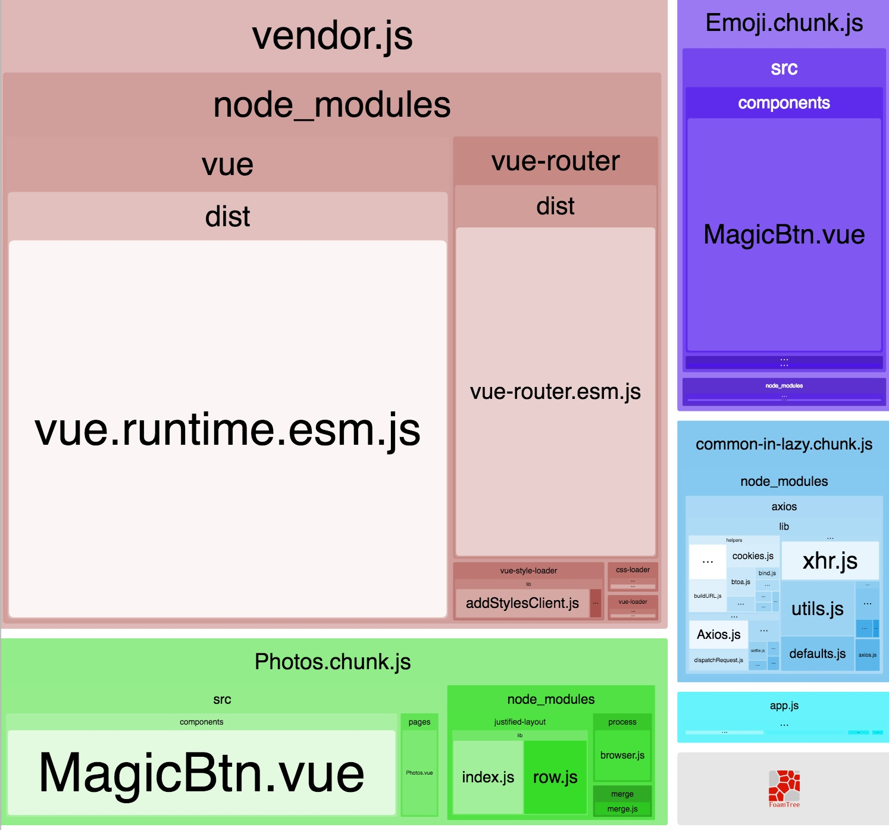
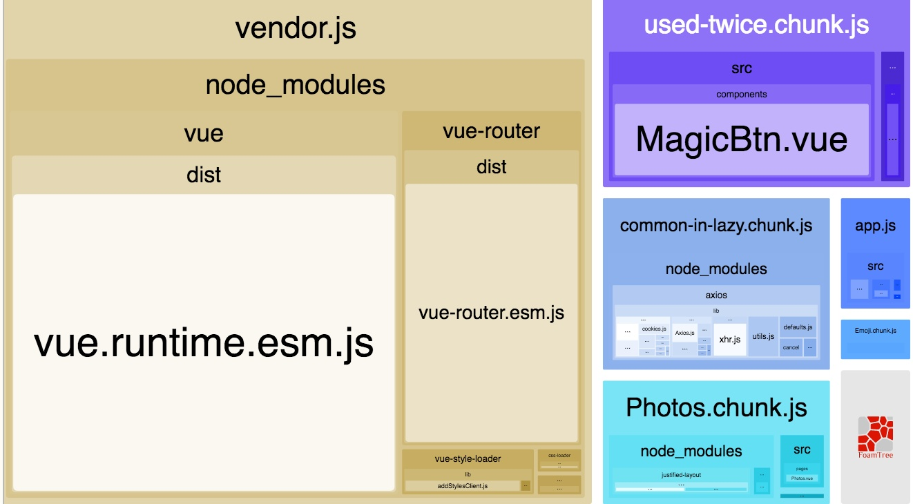

# Webpack 大法之 Code Splitting

今天，大家要学习的内容是 **Webpack 大法中的 Code Splitting**。

**Code Splitting 是什么以及为什么**

在以前，为了减少 HTTP 请求，通常地，我们都会把所有的代码都打包成一个单独的 JS 文件。但是，如果这个 JS 文件体积很大的话，那就得不偿失了。

这时，我们不妨把所有代码分成一块一块，需要某块代码的时候再去加载它；还可以利用浏览器的缓存，下次用到它的话，直接从缓存中读取。很显然，这种做法可以加快我们网页的加载速度，美滋滋！

所以说， [Code Splitting](https://webpack.js.org/guides/code-splitting/) 其实就是把代码分成很多很多块 **（chunk ）** 咯。

**Code Splitting 怎么做**

主要有 2 种方式：

[分离业务代码和第三方库](https://webpack.js.org/guides/code-splitting/#resource-splitting-for-caching-and-parallel-loads) （ vendor ）

[按需加载](https://webpack.js.org/guides/code-splitting/#resource-splitting-for-caching-and-parallel-loads) （利用 import() 语法）

之所以把业务代码和第三方库代码分离出来，是因为产品经理的需求是源源不断的，因此业务代码更新频率大，相反第三方库代码更新迭代相对较慢且可以锁版本，所以可以充分利用浏览器的缓存来加载这些第三方库。

而按需加载的适用场景，比如说「访问某个路由的时候再去加载对应的组件」，用户不一定会访问所有的路由，所以没必要把所有路由对应的组件都先在开始的加载完；更典型的例子是「某些用户他们的权限只能访问某些页面」，所以没必要把他们没权限访问的页面的代码也加载。

## 准备工作

我用 Vue.js 写了一个很简单的 demo ：它调用了一个 api ，然后显示返回的 emoji 表情。


接下来，看看第一次打包的情况：



可以看到，当前只有一个 chunk 也就是 app.js ，他是一个 entry chunk 。因为我们的 webpack 配置是这样子的：

```js
// webpack.config.js
module.exports = {
  entry: {
     app: './src/main.js', // entry chunk
  },
}
```

app.js 包含了我们的第三方库 vue 和 axios ，以及我们的业务代码 src 。

接下来，我们要把他们分离开。

## 分离 Vendor

最简单方法就是：加一个 entry

```js
// webpack.config.js
module.exports = {
  entry: {
    app: './src/main.js',
    vendor: ['vue', 'axios'],
  },
}
```

来，分析一下打包：



虽然 vendor.js 这个 entry chunk 包含了我们想要的 vue 和 axios ，但是细心的同学会发现， app.js 也包含了他们！为什么！？

其实这是很正常的事情：每个 entry 都包含了他自己的依赖，这样他才能作为一个入口，独立地跑起来。

很难受，事实上我们并不想 app.js 还包含了 vue 和 axios 。如果可以把他们俩相同的依赖提取出来就好了，就像这样：



如果想要提取公共模块的话，就需要用到 CommonsChunkPlugin 这个插件。

## CommonsChunkPlugin

现在，修改我们的 webpack 配置文件

```js
new webpack.optimize.CommonsChunkPlugin({
  name: 'vendor',
}),
```

> Webpack 大佬，在所有的 chunk 中，帮我找到依赖2次及以上的模块，然后移到 vendor 这个 chunk 里面，感激不尽。

1、所有的 chunk（ app.js 和 vendor.js ）中，app.js 和 vendor.js 都引用了 vue 和 axios

2、加起来2次，那把他们都移动到 vendor.js 里面。

3、最后，app.js 原本包含的 vue 和 axios 都移动到了 vendor.js 。

来看看我们此时的打包：



哈~哈~哈~ 这个就是我们想要的：app.js 这个 chunk 再也没有包含第三方库了，只剩下业务代码。

但是！随着业务的增长，我们依赖的第三方库代码很可能会越来越多，这时候我们的 webpack.config.js 就变成这样了：

```js
module.exports = {
  entry: {
    app: './src/main.js',
    vendor: [
      'vue',
      'axio',
      'vue-router',
      'vuex',
      'element-ui',
      // 很长很长
    ],
  },
}
```

vendor entry 会变成很长很长，更糟糕的是，我们每次引入了新的第三方库，都需要在 vendor 手动增加对应的包名。

## 自动化分离 vendor

如果我们想把所有 node_modules 目录下的所有 .js 都自动分离到 vendor.js ，则需要用到 minChunks：

```js
entry: {
  // vendor: ['vue', 'axios'] // 删掉!
},

new webpack.optimize.CommonsChunkPlugin({
  name: 'vendor',
  minChunks: ({ resource }) => (
    resource &&
    resource.indexOf('node_modules') >= 0 &&
    resource.match(/\.js$/)
  ),
}),
```

> Webpack 大佬，如果你看见某些模块是来自 node_modules 目录的，并且名字是 .js 结尾的话，麻烦把他们都移到 vendor chunk 里去，如果 vendor chunk 不存在的话，就创建一个新的。

1、找到了，vue 和 axios 都来自 node_modules 并且是 JS 文件

2、vendor chunk 不存在，那我就创建一个

3、把他们俩移动到 vendor chunk

此时此刻，我们的打包是这样子的：


跟之前的打包一模一样。酷~

## Dynamic Import

由于产品经理加了新的需求，我们的 demo 变成了这个样子，多加了路由：


同时我们的打包：



新增加的第三方库 vue-router 和 justified-layout 都自动移到了 vendor.js ，没毛病！

## import()

如果我们想「按需加载」路由组件的话，只要改几行代码就好了：

```js
// router.js

const Emoji = () => import(
  /* webpackChunkName: "Emoji" */
  './pages/Emoji.vue')

const Photos = () => import(
  /* webpackChunkName: "Photos" */
  './pages/Photos.vue')
```

注意到，我们使用了 webpack v2.4 的新功能，可以设置 chunk 的名字；同时别忘了还要改 webpack 配置：

```js
output: {
  chunkFilename: '[name].chunk.js',
}
```
如果你用了 Babel ，就需要装上这个插件：babel plugin syntax dynamic import 来解析 import() 语法。修改 .babelrc ：

```js
{
  "plugins": ["syntax-dynamic-import"]
}
```

迫不及待地想看看这个时候的打包：



很容易发现，多了 2 个 async chunk ，分别对应着我们 2 个路由的组件。

但是！他们居然都包含了 axios 。

在这之前，我们不是设置了让所有的 node_modules 都移到 vendor.js 里面了吗？！怎么现在不起作用了？

我觉得，Photos.chunk.js 和 Emoji.chunk.js 这两个都是按需加载的，所以在页面初始化的时候，不需要去加载没有用到的模块（ axios ），这样就可以减少首页体积的大小。

但是，这样的话会导致我访问 Photos 的时候，要加载 axios ，访问 Emoji 的时候，也需要去加载 axios ，这显然不是最佳方案，我们只想 axios 加载一次就够了。

## async flag

要解决上面的问题，我们需要用到 CommonsChunkPlugin 的 async 。

```js
// webpack.config.js

new webpack.optimize.CommonsChunkPlugin({
  async: 'common-in-lazy',
  minChunks: ({ resource } = {}) => (
    resource &&
    resource.includes('node_modules') &&
    /axios/.test(resource)
  ),
}),
```

> Webpack 大佬，帮我在所有的 async chunk 中，找到来自 node_modules ，并且名字带有 axios 的模块。

1、所有的 async chunk ，就是 import() 产生的 chunk ，也就是 Emoji.chunk.js 和 Photos.chunk.js

2、Emoji.chunk.js 和 Photos.chunk.js 都包含了 axios ，所以把他移动到名叫 common-in-lazy 的 chunk 中

3、common-in-lazy chunk 并不存在，那就新建一个吧。

是时候看一下我们的打包了：



完美～ common-lazy-chunk 包含了原本在 Emoji.chunk.js 和 Photos.chunk.js 中的 axios 。

如果足够细心，你会发现：Emoji.chunk.js 和 Photos.chunk.js 都包含了我们自定义的一个组件 MagicBtn 。同理地我们可以用上面的方法把他提取出来，但是如果还有 MagicBtn2 ，MagicBtn3 等等的话，那我们就要写成 /MagicBtn1|MagicBtn2|.../.test(resource) ，很显然没人喜欢这样做。

所以呢，另一个方法是利用 count ：

```js
new webpack.optimize.CommonsChunkPlugin({
  async: 'used-twice',
  minChunks: (module, count) => (
    count >= 2
  ),
})
```

在所有的 async chunk ( Emoji.chunk.js 和 Photos.chunk.js ) 中找到引用 2 次以上的模块，也就是 MagicBtn 咯，那把他挪到 used-twice chunk 中，如果 used-twice 不存在的话，那就创建一个。

最后，我们的打包：



原本 Emoji.chunk.js 和 Photos.chunk.js 中的 MagicBtn 都移动到了 used-twice.chunk.js 中。

大功已告成！

## Summary

冷静总结一下：

> 你的 Code Splitting = webpack bundle analyzer + CommonsChunkPlugin + 你的分析

别忘了，我们做 Code Splitting 的目的是为了利用浏览器的缓存，那怎样才能充分利用浏览器的缓存呢？让我们拭目以待。

## 当然一定要看的文章

[Vendor and code splitting in webpack 2](https://medium.com/@adamrackis/vendor-and-code-splitting-in-webpack-2-6376358f1923)

[Webpack Docs - Code Splitting](https://webpack.js.org/guides/code-splitting/)

[Survivejs - Webpack/Bundle Splitting](https://survivejs.com/webpack/building/bundle-splitting/)

[Webpack Bits: Getting the most out of the CommonsChunkPlugin](https://medium.com/webpack/webpack-bits-getting-the-most-out-of-the-commonschunkplugin-ab389e5f318)

[转载](https://zhuanlan.zhihu.com/p/26710831?refer=ElemeFE)
