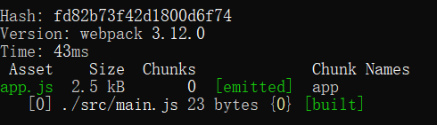
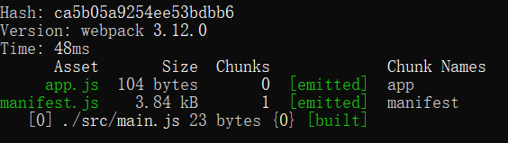
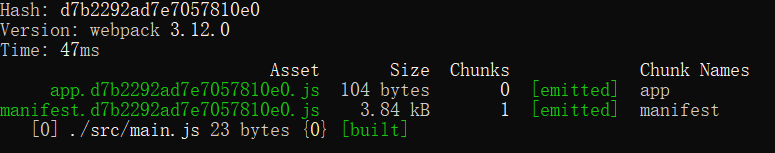
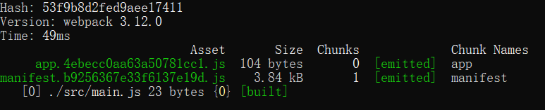
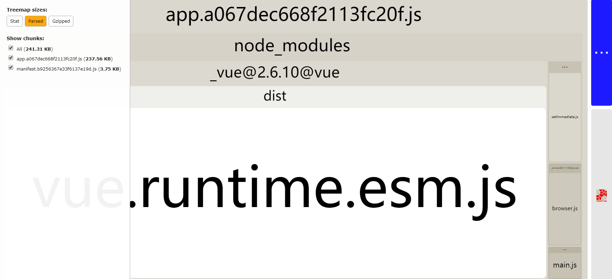
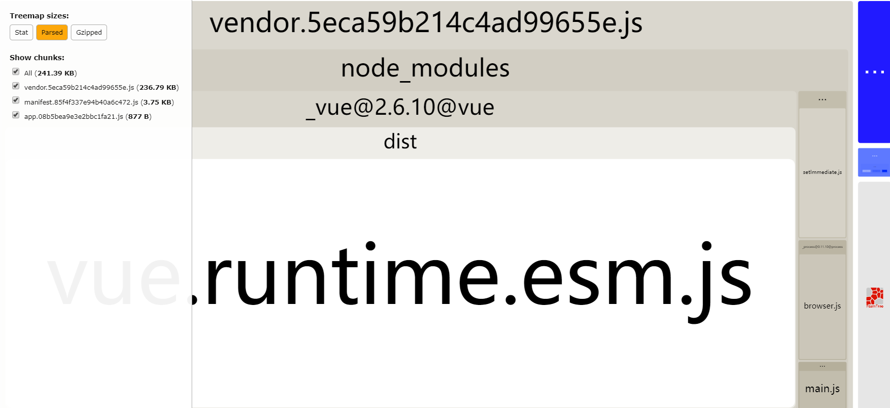
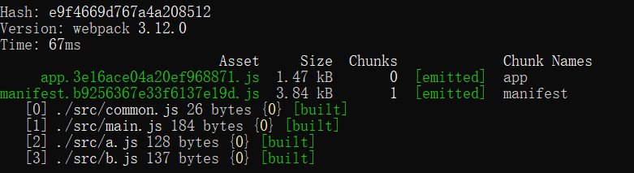
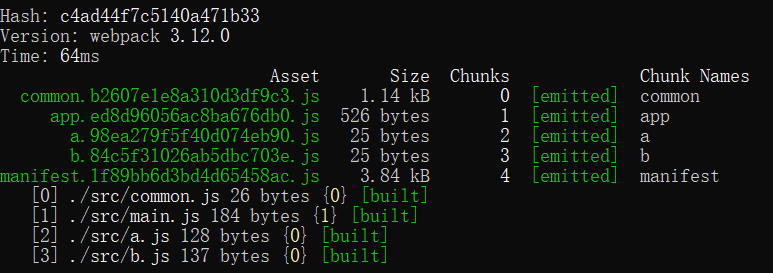

# webpack优化-代码分割

我们知道，在前端工程化中js的优化一直是比较热门的话题。 包括第三方依赖、公共函数库、js模块等等如何组织到一起，webpack都提供了一整套比较好的方案。

在文本中，我期望从某一个较小的点逐步切入的方式，通过一些webpack配置，学习js模块化打包的优化流程。

> 本文参考的是 `vue2.5.2` 版本的 `webpack` 配置。

我们先从一个简单的实例开始

创建 `./src/main.js` ， `./build/build.js` 。

```js
// ./src/main.js

console.log('main.js');
```

```js
// ./build/build.js

'use strict'

const webpack = require('webpack')
const path = require('path')

module.exports = {
  context: path.resolve(__dirname, '../'), // 设置工程根目录
  entry: { // 入口
    app: './src/main.js'
  },
  output: { // 出口
    path: path.resolve(__dirname, '../dist'), // 打包至根目录 dist 文件夹下
    filename: '[name].js'
  }

}
```

在 `package.json` 中添加 `build` 执行： `"build": "webpack --config build/build.js"` ，运行 `npm run build` 。



打包生成了一个 `app.js` 。

但是 `./src/main.js` 只有一行代码，webpack打包为什么会这么多呢？这里面其实包含了 `webpack` 的[runtime](https://webpack.js.org/concepts/manifest/#manifest)。他们一般不会改变，所以可以提取出来单独打包。

```js
// ./build/build.js

new webpack.optimize.CommonsChunkPlugin({
  name: 'manifest',
  minChunks: Infinity
})
```



可以看到 `app.js` 小了很多。

还有个问题：js的文件名叫 `app.js` ，如果修改了一行代码后再上传服务器，可能会因为缓存导致加载的是缓存的 `app.js` ，新修改的那行代码就不在这个老版本的 `app.js` 中。

`webpack` 提供了 `hash` 字段让每次生成的js都不同，这样就不存在可能加载缓存的问题了。

```js
// ./build/build.js

output: {
  path: path.resolve(__dirname, '../dist'),
  filename: '[name].[hash].js'
}
```



有个值得注意的点，如果多测几次就会发现，一旦修改任何代码，所有的js文件名都会修改，这显然不符合期望。比如我们单独提取 `manifest.js` 就是想要这个js在不修改的情况下只开始加载一次，其他时候调用浏览器缓存减少HTTP请求。这时，需要把 `hash` 修改成 `chunkhash` 。

```js
// ./build/build.js

output: {
  path: path.resolve(__dirname, '../dist'),
  filename: '[name].[chunkhash].js'
}
```



这样，不管如何修改 `./src/main.js` ， `manifest.b9256367e33f6137e19d.js` 都不会变。

我们再增加两个js `./src/a.js` 、 `./src/b.js` 。

```js
// ./src/a.js

import Vue from 'vue'

console.log('a.js')
```

```js
// ./src/b.js

import Vue from 'vue'

console.log('b.js')
```

同时修改 `./src/main.js` 

```js
import a from './a.js'
```

`./build/build.js`

```js
const BundleAnalyzerPlugin = require('webpack-bundle-analyzer').BundleAnalyzerPlugin

plugins: [
  new BundleAnalyzerPlugin()
]
```

通过 `webpack-bundle-analyzer` 可以看到打包后js的依赖关系。



可以看到 `app.js` 中包含了 `vue.js` 。因为 `vue.js` 一般来说也是不怎么会修改的，所以也要尽量单独打包。

向 `./build/build.js` 中添加：

```js

new webpack.optimize.CommonsChunkPlugin({
  name: 'vendor',
  minChunks (module) {
    return (
      module.resource &&
      /\.js$/.test(module.resource) &&
      module.resource.indexOf(
        path.join(__dirname, '../node_modules')
      ) === 0
    )
  }
})
```

这段代码是将 `node_modules` 中的所有库都打包到 `vendor.js` 



再修改一下 `./src/main.js` 、 `./src/a.js` 和 `./src/b.js` ，在 `a.js` 中通过异步的方式引入 `b.js` :

```js
// ./src/main.js

import a from './a.js'
```

```js
// ./src/a.js

import Vue from 'vue'

import('./b.js') // 异步的方式引入 b.js 
```

```js
// ./src/b.js

import Vue from 'vue'
import Axios from 'axios'
```

打包后发现 `b.js` 中还是包含 `axios.js` 

修改 `./build/build.js` ，打包所有的异步加载的库至 `vendor-async.js` 

```js
new webpack.optimize.CommonsChunkPlugin({
  async: 'vendor-async',
  minChunks (module) {
    return (
      module.resource &&
      /\.js$/.test(module.resource) &&
      module.resource.indexOf(
        path.join(__dirname, '../node_modules')
      ) === 0
    )
  }
})
```

## 总结

### `CommonsChunkPlugin` 

由于这里的优化大部分靠 `CommonsChunkPlugin` ，所以对[CommonsChunkPlugin](https://webpack.js.org/plugins/commons-chunk-plugin/#options)的配置分析一下

**`name`** ： `chunk` 名称

**`names`** ： `chunk` 名称的数组合集

例如，有两个

```js
new webpack.optimize.CommonsChunkPlugin({
  name: 'manifest',
  minChunks: Infinity
})
```

```js
new webpack.optimize.CommonsChunkPlugin({
  name: 'manifest2',
  minChunks: Infinity
})
```

配置相同，只是 `name` 不同，可以合并写：

```js
new webpack.optimize.CommonsChunkPlugin({
  names: ['manifest', 'manifest2'],
  minChunks: Infinity
})
```

**`filename`** ：配置生成文件的文件名，比如取 `filename: "a.js"` ，那么生成的js就叫 `a.js` 。没配置则使用 `name` 字段的名称。

**`minChunks`** ：公共代码引入次数。例如有 `common.js` 文件， `a.js` 、 `b.js` 都引入了 `common.js` 。如果我们想把它提取出来单独打包，则可以写成

```js
minChunks: 2
```

**`chunks`** ：提取公共代码块的范围

```js
entry: {
  app: './src/main.js',
  a: './src/a.js',
  b: './src/b.js'
}

new webpack.optimize.CommonsChunkPlugin({
  name: 'vendor',
  chunks: ['app', 'a']
})
```

表示提取 `app.js` 、 `b.js` 一起打包。

**`children`** ：是否查找子模块

**`deepChildren`** ：是否查找后代模块

**`async`** ：配置异步引入的打包方式

### `common.js`

对于第三方依赖，如 `vue` 等由于几乎不怎么变动，我们可以单独打包。异步引入 `vue` 的话也有异步的打包方式。

但是对于自己编写的公共函数，如 `common.js` 则不行。示例如下：

在 `./src/main.js` 中引入了 `./src/a.js` 、 `./src/b.js` 而 `./src/a.js` 与 `./src/b.js` 中都包含了公共函数库 `./src/common.js`  

```js
// ./src/main.js

import a from './a.js'
import b from './b.js'
```

```js
// ./src/a.js

import common from './common.js'
```

```js
// ./src/b.js

import common from './common.js'
```

```js
// ./build/build.js

new webpack.optimize.CommonsChunkPlugin({
  name: 'common',
  minChunks: 2
}),

new webpack.optimize.CommonsChunkPlugin({
  name: 'manifest',
  minChunks: Infinity
})
```




可以发现生成的 `app.js` 中包含 `common.js` ，配置的 `minChunks: 2` 并没有生效。

只有修改 `entry` 

```js
// ./build/build.js

entry: {
  app: './src/main.js',
  a: './src/a.js',
  b: './src/b.js'
}
```

改为多入口，才生效


